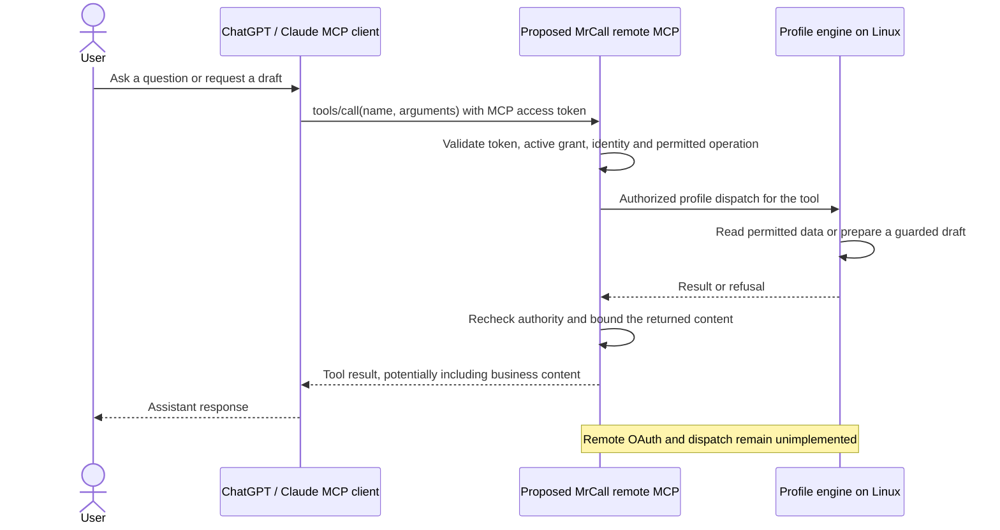

# Operator data flows

<!-- doc-scope:start -->
Scope: entry point, remote-request overview and implementation-status boundaries for the English Desktop and operator MCP sequences. Detailed flows live in the linked pages; this explanation does not authorize implementation or expand the original onboarding product scope.
<!-- doc-scope:end -->

**Implementation boundary:** Desktop Firebase authentication and its WSS engine connection exist on `main`. The nine-tool local MCP exists only as an **uncommitted, unreleased candidate in isolated `feat/desktop-operator-mcp-20261008` worktrees** and is **absent from main**. Remote MCP, OAuth, the authorized engine/workspace bridge and company-project file upload in this design are **unimplemented proposals**.

A ChatGPT or Claude account is independent of the MrCall Firebase UID. OAuth consent would link a particular AI client to an authorized MrCall profile and company; it would not make the two accounts the same identity. The proposed MCP access token must never pass through the existing Firebase-only WSS authentication boundary.

No general local filesystem access is provided by these nine candidate tools. An AI conversation attachment, a future MrCall upload, and a separately authorized local filesystem tool are different paths. A path or MCP root alone transfers no bytes.

## Proposed remote request flow

This overview describes the unimplemented remote service after authorization.
The MCP adapter and engine are logical components of the Linux service;
their authorized internal dispatch is not an existing transport.

## Implementation status and navigation

| Area | Status | Sequences |
|------|--------|-----------|
| Desktop login and authenticated engine WSS | Existing on main | [1 · Desktop login](operator-data-flows/authentication.md#1--first-mrcall-desktop-login) |
| Remote MCP login and session | Unimplemented proposal; no remote OAuth or authorized bridge | [3 · OAuth and 4 · session](operator-data-flows/authentication.md) |
| Nine-tool mapping | Isolated local candidate only; uncommitted, unreleased, absent from main | [5 · reads, 6 · context, 7 · ask, 8 · draft](operator-data-flows/tools.md) |
| Files and remote lifecycle | Limited local candidate; upload/general filesystem extensions and remote revocation unimplemented | [9 · files and 10 · lifecycle](operator-data-flows/files-and-lifecycle.md) |
| Workspace and STDIO connector | Isolated local candidate only; client installation acceptance unverified | [2 · workspace and 11 · local connector](operator-data-flows/local-connector.md) |

The candidate transport uses the SDK 1.x `initialize` / `notifications/initialized` pattern and negotiated 2025 protocol compatibility. Real remote clients must negotiate a supported version; this is not a claim that every current client uses that handshake unchanged. Later remote MCP-to-engine arrows specify intended methods and payloads, not an implemented transport.

## Evidence and related contracts

Existing contracts are described in [remote backend](remote-backend.md), [IPC contract](ipc-contract.md), [cross-cutting runtime contracts](cross-cutting-contracts.md) and [operator setup](operator-setup.md). The [original onboarding brief](briefs/2026-09-10-desktop-to-operator-onboarding.md) retains its original product scope.

Existing Desktop main code: [Firebase sign-in UI](../app/src/renderer/src/views/SignIn.tsx), [Desktop session integration](../app/src/main/index.ts), [WSS client](../app/src/main/wsRpcClient.ts) and [engine WSS authentication](../engine/zylch/rpc/server_ws.py). These links point to main code, not the MCP candidate.

Candidate provenance: isolated `feat/desktop-operator-mcp-20261008` worktrees contain the uncommitted cs-kernel modules `cs/desktop_mcp.py` and `cs/desktop_managed.py`, plus Desktop `app/src/main/operatorWorkspace.ts`. These names are textual references because the candidate is absent from main. Candidate source, SDK and browser-fixture tests and Linux frozen discovery were verified; actual provider installation, macOS/Windows execution and genuine Firebase authentication remain unverified. This evidence does not establish release or provider acceptance.

Official references: [OpenAI plugin authentication](https://developers.openai.com/plugins/build/auth), [Claude remote MCP connectors](https://support.claude.com/en/articles/11175166-get-started-with-custom-connectors-using-remote-mcp), [MCP authorization specification](https://modelcontextprotocol.io/specification/2026-07-28/basic/authorization) and [MCP 2025 lifecycle specification](https://modelcontextprotocol.io/specification/2025-06-18/basic/lifecycle). These references describe external protocol/client contracts; they do not establish that MrCall has implemented the proposed remote service.
