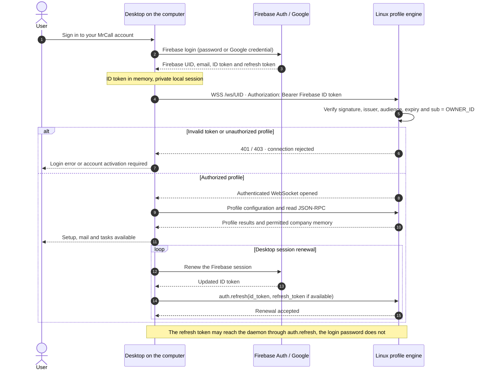
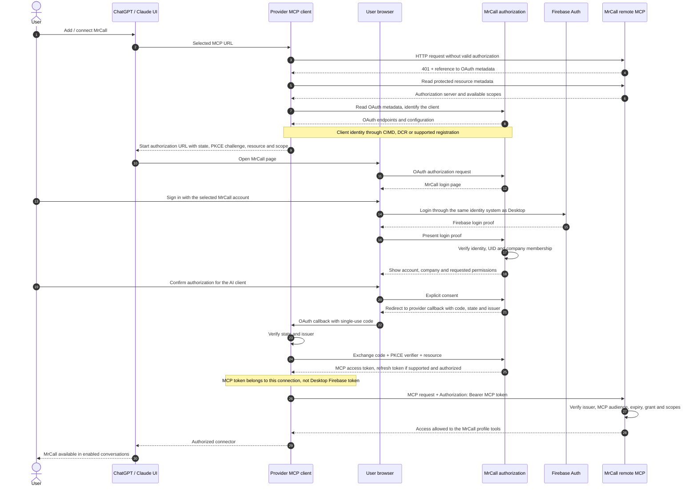
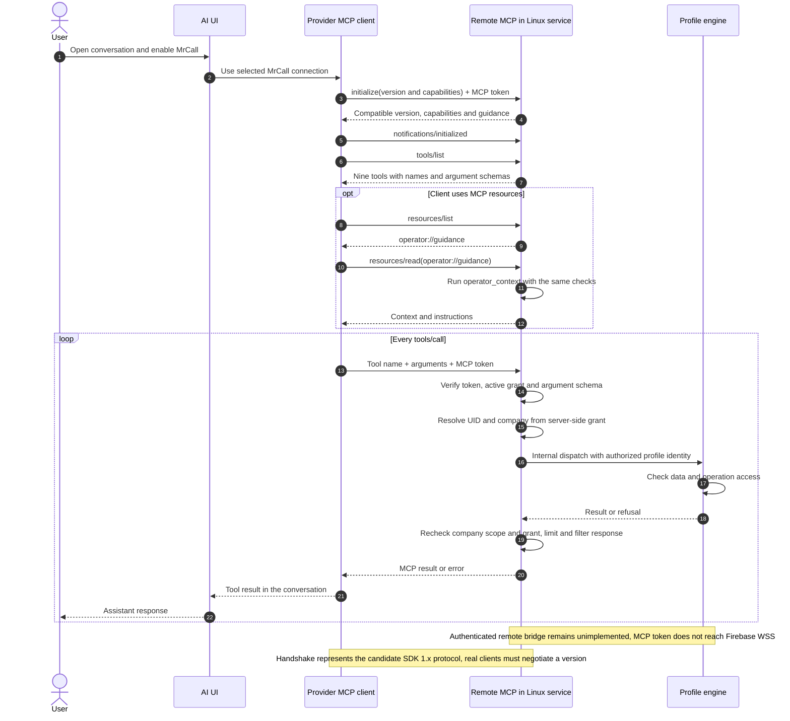

# Authentication and sessions

<!-- doc-scope:start -->
Scope: English sequence descriptions for authentication and sessions; existing behavior, isolated candidate behavior and unimplemented proposals are explicitly distinguished.
<!-- doc-scope:end -->

[Back to the data-flow index](../operator-data-flows.md).

**Implementation boundary:** Desktop Firebase authentication and its WSS engine connection exist on `main`. The nine-tool local MCP exists only as an **uncommitted, unreleased candidate in isolated `feat/desktop-operator-mcp-20261008` worktrees** and is **absent from main**. Remote MCP, OAuth, the authorized engine/workspace bridge and company-project file upload in this design are **unimplemented proposals**.

## 1 · First MrCall Desktop login

**Status: EXISTING ON MAIN — verified code.**

This case assumes a remote backend is already activated. Login identifies the profile; it does not automatically provision a hosted tenant. Firebase UID is the identity, not the email. Google and email/password login are alternative paths.

## 3 · Connecting ChatGPT or Claude to MrCall

**Status: UNIMPLEMENTED PROPOSAL — remote MCP and OAuth.**

AI UI means the app/web interface; MCP client means the provider component making remote requests. Browser login and token exchange are separate flows. The MrCall password and Firebase session are not handed to the AI client. Claude explicitly documents connections from its cloud infrastructure.

## 4 · MCP session and per-call checks

**Status: UNIMPLEMENTED REMOTE PROPOSAL — tool design based on the local candidate.**

The authorized engine bridge remains unimplemented. It cannot forward an MCP token to the existing WebSocket, which requires Firebase. M and E are logical components and could share a daemon using authorized internal calls. Later M→E arrows describe methods and payloads, not an implemented remote transport. The handshake is the SDK 1.x candidate pattern with negotiated 2025 compatibility, not a universal claim about current remote clients.

