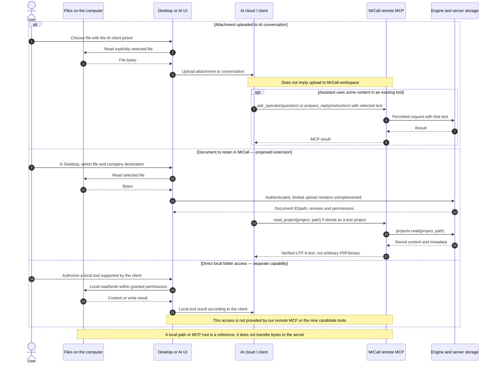
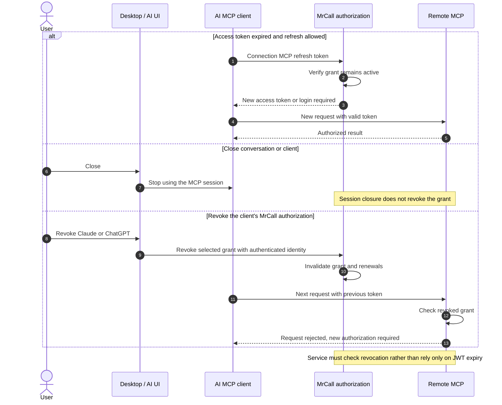

# Files and connection lifecycle

<!-- doc-scope:start -->
Scope: English sequence descriptions for files and connection lifecycle; existing behavior, isolated candidate behavior and unimplemented proposals are explicitly distinguished.
<!-- doc-scope:end -->

[Back to the data-flow index](../operator-data-flows.md).

**Implementation boundary:** Desktop Firebase authentication and its WSS engine connection exist on `main`. The nine-tool local MCP exists only as an **uncommitted, unreleased candidate in isolated `feat/desktop-operator-mcp-20261008` worktrees** and is **absent from main**. Remote MCP, OAuth, the authorized engine/workspace bridge and company-project file upload in this design are **unimplemented proposals**.

## 9 · Files on the computer: three separate cases

**Status: LIMITED LOCAL CANDIDATE / UNIMPLEMENTED EXTENSIONS.**

The candidate MCP exposes no read_file, write_file, upload_file, download_file or shell. read_project reads engine documents; operator_context reads only canonical workspace files. The company-project upload and general local-access branches below are proposals, not implemented capabilities of this MCP. Existing Desktop chat attachment-transfer workflows are separate from the proposed company-project upload.

## 10 · Remote connection renewal, closure and revocation

**Status: UNIMPLEMENTED PROPOSAL — revocation policy.**

Revoking an AI-client grant and signing out of Desktop are distinct events. Remote behavior on Desktop logout remains to be decided and implemented; the local candidate revokes on logout. Revocation stops subsequent requests but does not retract data already shown or work already submitted.

