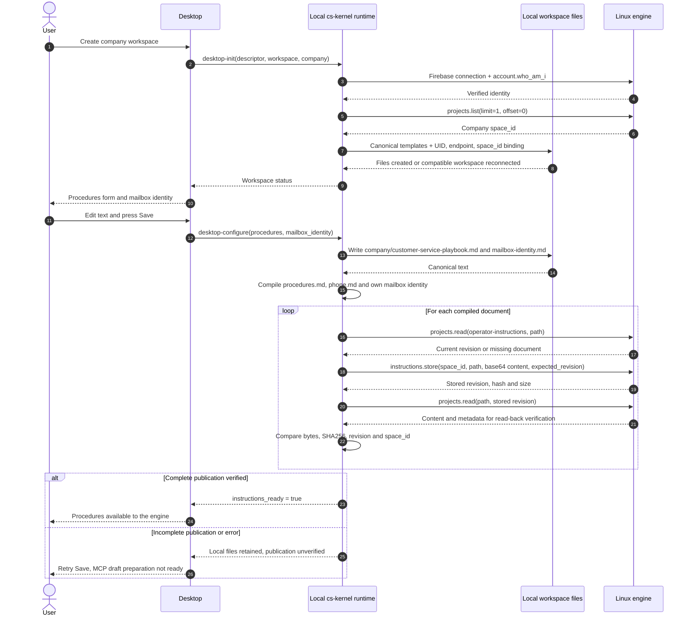
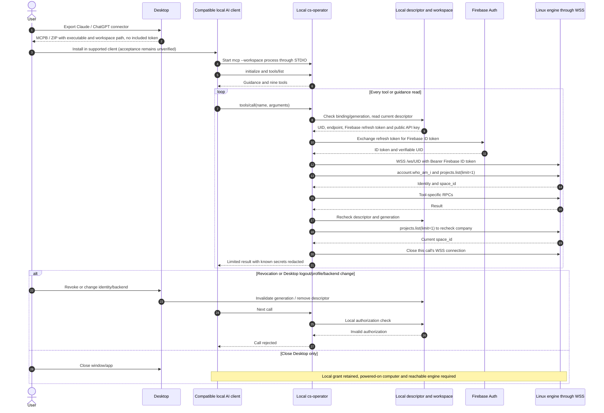

# Local connector candidate

<!-- doc-scope:start -->
Scope: English sequence descriptions for local connector candidate; existing behavior, isolated candidate behavior and unimplemented proposals are explicitly distinguished.
<!-- doc-scope:end -->

[Back to the data-flow index](../operator-data-flows.md).

**Implementation boundary:** Desktop Firebase authentication and its WSS engine connection exist on `main`. The nine-tool local MCP exists only as an **uncommitted, unreleased candidate in isolated `feat/desktop-operator-mcp-20261008` worktrees** and is **absent from main**. Remote MCP, OAuth, the authorized engine/workspace bridge and company-project file upload in this design are **unimplemented proposals**.

## 2 · Workspace preparation and procedure saving

**Status: LOCAL CANDIDATE ONLY — uncommitted and unreleased, absent from main.**

Here canonical files live on the user’s computer. The proposed remote architecture would host them on the server; transfer and provisioning remain unimplemented. Mailbox settings remain engine-owned.

## 11 · Comparison: the implemented local MCP candidate

**Status: LOCAL CANDIDATE ONLY — client installation acceptance unverified.**

The client launches cs-operator on the computer. It does not use remote OAuth. The exported package contains the command and executable without tokens; the program reads the private local descriptor. The nine-tool mapping in cases 5–8 is implemented on this transport only in the isolated candidate.

