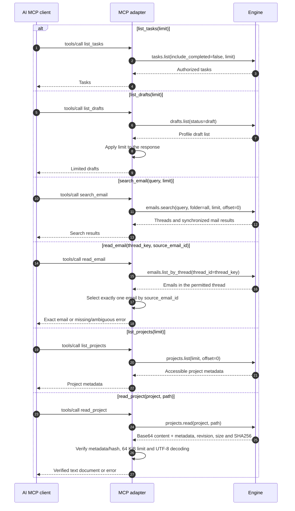
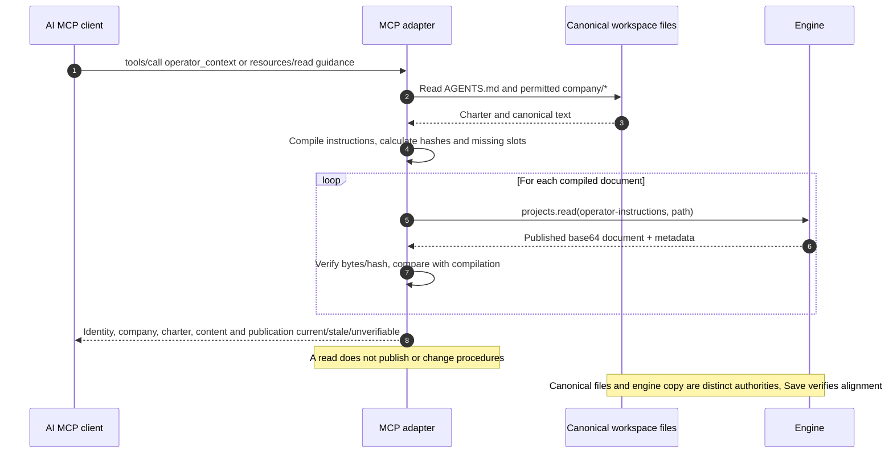
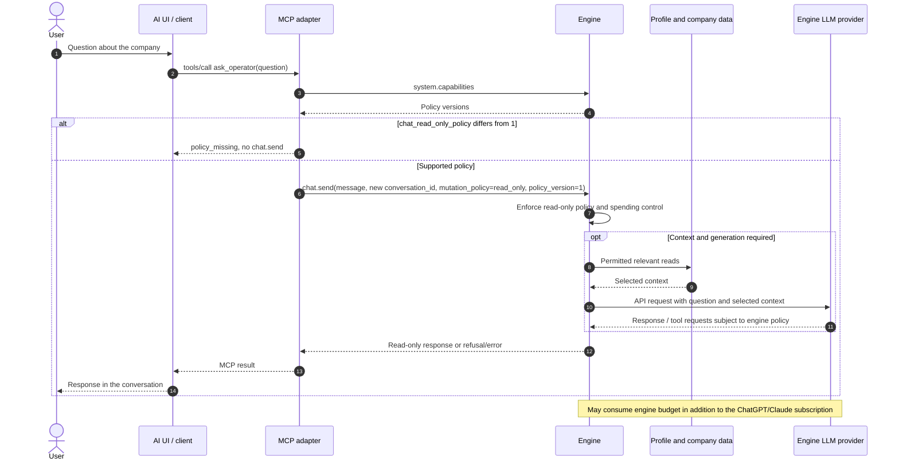
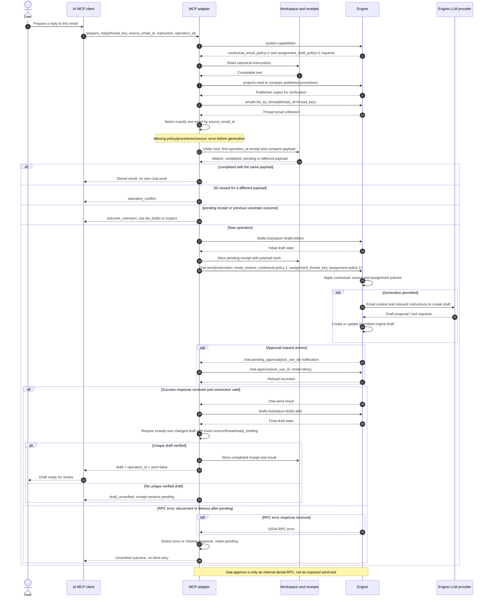

# Tools and engine RPC mapping

<!-- doc-scope:start -->
Scope: English sequence descriptions for tools and engine rpc mapping; existing behavior, isolated candidate behavior and unimplemented proposals are explicitly distinguished.
<!-- doc-scope:end -->

[Back to the data-flow index](../operator-data-flows.md).

**Implementation boundary:** Desktop Firebase authentication and its WSS engine connection exist on `main`. The nine-tool local MCP exists only as an **uncommitted, unreleased candidate in isolated `feat/desktop-operator-mcp-20261008` worktrees** and is **absent from main**. Remote MCP, OAuth, the authorized engine/workspace bridge and company-project file upload in this design are **unimplemented proposals**.

## 5 · All reads: six tools and their RPCs

**Status: LOCAL CANDIDATE MAPPING — remote port unimplemented.**

These are alternative calls, not a mandatory sequence on every request. The checks in case 4 apply to the remote proposal. Mail, tasks and drafts belong to the profile; projects follow company-memory permissions. The AI client does not read Gmail/IMAP directly.

## 6 · operator_context: procedures and file authority

**Status: LOCAL CANDIDATE MAPPING — local files; server workspace unimplemented.**

W is the workspace on the computer in the candidate; in the remote proposal W would be the server workspace. Canonical files are the procedure source; the engine holds derived, revisioned copies. This tool accepts no arbitrary computer path.

## 7 · ask_operator: a company-memory question

**Status: LOCAL CANDIDATE MAPPING — engine-enforced read-only policy.**

The ChatGPT/Claude conversation model and the engine API model are separate processing steps with separate credentials and costs. Internal reads depend on the question; the engine-model arrow represents selected context, not the entire memory.

## 8 · prepare_reply: exact draft, retries and uncertain outcomes

**Status: LOCAL CANDIDATE MAPPING — no MCP email sending.**

Capabilities, procedures and source checks also precede returning a completed result. operation_id is an adapter idempotency key; it is not forwarded as native chat.send idempotency. An uncertain outcome requires draft inspection.

## Nine-tool mapping

This table describes the isolated local candidate, not a released or main-branch MCP service.

| Tool | Source / engine RPC | Result boundary |
|------|---------------------|-----------------|
| `operator_context` | `AGENTS.md + permitted company/* files; projects.read(operator-instructions, path)` | Read and compare publication |
| `list_tasks` | `tasks.list(include_completed=false, limit)` | Private profile tasks |
| `list_drafts` | `drafts.list(status=draft); adapter applies limit` | Private engine drafts |
| `search_email` | `emails.search(query, folder=all, limit, offset=0)` | Synchronized profile mail |
| `read_email` | `emails.list_by_thread(thread_id); exact selection by ID` | One exact email |
| `list_projects` | `projects.list(limit, offset=0)` | Permitted company metadata |
| `read_project` | `projects.read(project, path); metadata/SHA256 and UTF-8 verification` | Text document up to 64 KiB |
| `ask_operator` | `system.capabilities + chat.send with read_only and policy 1` | Response; engine cost possible |
| `prepare_reply` | `capabilities + context + source + drafts.list before/after + chat.send; chat.approve only deny` | Persistent draft, sent=false |
