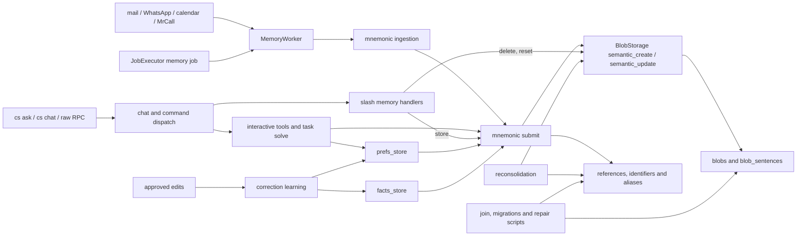

# Mnemonic writer inventory

This is the executable freeze of the memory write graph for the mnemonic
harness plan. It describes the production write graph as it is; the
single-writer seam is not complete. The executable source of truth is
`tests/fixtures/mnemonic/legacy_writer_inventory.json`, checked by
`tests/memory/test_mnemonic_inventory.py` and
`tests/memory/test_mnemonic_kernel_inventory.py`. Every temporary entry names
the milestone that must remove or constrain it. Adding a direct writer without
updating that reviewed inventory fails the test.

## Current call graph

Every semantic loop is one loop. The channel workers collect a source and hand
it to `mnemonic/ingestion.py`; the background memory job runs the worker's own
coroutine per item; interactive `create_memory`, `update_memory`, the task
solve and `/memory store` submit events; `prefs_store`, `facts_store` and
correction learning are adapters over `submit()`. What still writes outside the
harness is reconsolidation with its alias writer and donor delete (milestone
7), the owner's `/memory delete` and `/memory reset` (milestone 1's gate, no
model), and join, migrations and the repair scripts (milestone 8).

`BlobStorage.store_blob` and `update_blob` are the common low-level blob
writers and are not capability protected; the same primitives now also back
`semantic_create` / `semantic_update`, which are. Associations and identity
meaning can also change through `Storage.add_*_blob_link`,
`add_person_identifiers`, `migrate_blob_references` and the reconsolidation
alias writer; those four now delegate to the transaction-scoped forms in
`memory/associations.py`, so one implementation serves both the legacy
standalone sessions and the semantic commit's single transaction. Join, company-key/split/identifier migrations and three repair
scripts contain direct SQL or fixed ORM writes outside those methods. The
manifest distinguishes these mechanical or migration candidates from runtime
semantic adapters so Milestone 8 can review each one rather than granting a
general offline exemption.

## Finite legacy allowlist

The JSON inventory freezes six independently scanned sets:

- calls to semantic writer helpers, including nested aliases and their exact
  enclosing symbol, count, execution mode and owning milestone;
- direct ORM construction of blob, sentence, association, identifier and alias
  rows;
- ORM `update`/`delete` operations on those models;
- direct assignments to a queried or constructed ORM row, independent of the
  local variable name (the current four are `Blob.content`, `embedding`,
  `events` and `updated_at` in `BlobStorage._rewrite`); `setattr` on a bound
  row, imported model aliases, inline query-result assignments and a row handed
  in as a parameter annotated with a tracked model are treated as the same
  write;
- SQLAlchemy Core `insert`/`update`/`delete` operations on tracked models,
  including the two `MemoryMeta` lock/mutation-sequence updates;
- literal `INSERT`, `UPDATE` and `DELETE` statements against mnemonic tables.

`memory_meta` is included because the eventual commit must carry the mutation
sequence atomically. Its fixed seed, self-notion, sweep and join writes are now
listed alongside blob sinks rather than hidden as coordination detail.

Six fixed dynamic-SQL implementations are recorded separately because a plain
literal matcher cannot represent their table construction honestly. They cover
the join helper's association/index/alias copies, company-key stamping, the
identifier-table rebuild, and the memory split's forward copy, profile-table
drop and rollback restore. Every one is bounded to an explicit table tuple and
belongs to Milestone 8 review; there is no generic offline-write exemption.

Two aliases are explicit beyond the plan's grouped table:
`handle_reset._reset_all_data` reaches
`BlobStorage.delete_all_blobs`, and
`Storage.delete_whatsapp_message_by_message_id` directly deletes semantic
association rows while enforcing source retention. The first belongs to the
Milestone 1 reset gate; the second is a fixed deletion/retention path for
Milestone 8 review.

The ownership sequence is:

| Milestone | Temporary owners |
|---|---|
| 1 | mutation authorization before slash/reset routing and kernel request policy |
| 3 | guarded `BlobStorage` commit primitives and transaction-scoped sinks (installed: `semantic_create`/`semantic_update` under a permit, `memory/associations.py`) |
| 4 | interactive create/update and task-solve adapters |
| 5 | no writer conversion: retention under every rewrite, the departure record and the mechanical restore |
| 6 | installed: ingestion, the job facade, the helper-writer adapters and the memory verb write through the harness; the four adapter doors (`store_rule` and `refine_rule` from the tools, `store_rule` and `upsert_fact` from correction learning) stay listed as the edges a re-added direct write would surface on |
| 7 | reconsolidation, reference migration, donor deletion and aliases |
| 8 | join, storage migrations, backfills and semantic repair scripts |

## Kernel and permission edges

`cs-kernel` has no memory persistence and remains an RPC client. Its current
edges are nevertheless part of the freeze:

- `cmd_ask` calls `rpc.chat` with an empty tool allowlist. That controls pending
  tool approvals but is not a server-enforced read-only request policy.
- `cmd_chat` accepts caller-selected tool names; `rpc.chat` approves pending
  calls by matching those names.
- `cmd_draft_reply` also passes an empty allowlist but intentionally creates an
  engine draft, while `cmd_draft_send` permits only `send_draft` through an
  exact-input predicate. The executable inventory keeps both callers visible
  so Milestone 1 cannot infer read-only meaning from an empty set alone.
- `rpc.chat` currently normalizes missing permissions with `allow_tools or
  set()`, sends `chat.send`, observes `chat.pending_approval`, and answers via
  `chat.approve`; the method names and payload keys are frozen by AST.
- the scheduled/headless `cmd_catchup` path calls `sync.run` followed by
  `update.run`, so the paid memory/task pipeline remains an explicit effect.
- the scheduled template broadly allows `cs rpc`; the cron template denies
  raw `rpc chat` literally, and the update, reconsolidation, join, reset,
  restore and preparation-resume RPCs through its rendered raw-RPC list.

The template audit counts every current spelling for `cs memory`, `catchup
--check`, `ask`, `draft-reply`, broad `rpc`, and the cron denials for
`draft-send`, `chat` and `rpc chat`. It also verifies that the engine really
registers `update.run`, `memory.reconsolidate_now`, `memory.join`,
`memory.restore_version` and `preparation.resume`, and that the cron template
carries no literal denial line for them: they are denied through its rendered
raw-RPC list, which the kernel's own gate 17 checks against the verbs it
expects. The normalized chat-effect inventory covers memory store/force,
delete/reset, agent memory run/process, jobs resume, update and hard reset;
each entry is tied to its current slash-command route and engine handler.

Those are audit findings for Milestone 1 and later approval binding. Milestone
0 intentionally does not change routing or permissions.

## Behavioral fixtures

`tests/fixtures/mnemonic/incidents.json` is the bounded semantic corpus. Each
case retains the original observation separately from hints and candidates and
states semantic invariants rather than formatter text. It covers unrelated
same-name people, a shared switchboard, corroborated identity, customer number
and price corrections, company hours, account feedback, planned work,
contradictory legacy representations, malformed/truncated output and a
multi-entity source with stable child keys.

`current_behavior.json` and `test_mnemonic_fixtures.py` capture the starting
storage behavior with actual temporary profile and company SQLite databases:
company entities and FACTs are visible across owners sharing the key, account
rules are private, a known customer-shaped legacy FACT is still returned by an
ordinary category read, and the email memory checkpoint is owner-scoped but
source-grained. Later milestones must change an expectation only alongside the
corresponding production boundary.
