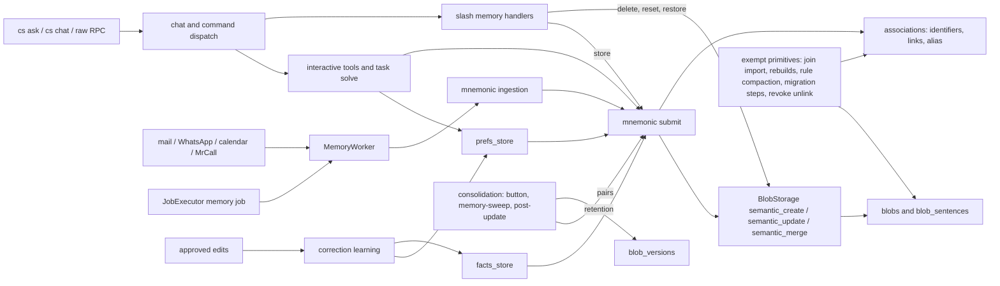

# Mnemonic writer inventory

This is the executable freeze of the memory write graph, and since milestone 8
the boundary it describes is sealed. The executable source of truth is
`tests/fixtures/mnemonic/legacy_writer_inventory.json`, checked by
`tests/memory/test_mnemonic_inventory.py`,
`tests/memory/test_mnemonic_kernel_inventory.py` and
`tests/memory/test_mnemonic_write_boundary.py`, which
`.github/workflows/memory-boundary.yml` runs on every change to `engine/`
(`mnemonic-journey.yml` runs the kernel audit again, against the kernel commit
it pins).
Every writer edge in `zylch/` and `scripts/` is either the harness's own
mechanism (a row with the `milestone`, 1–7, that installed it) or a reviewed
mechanical primitive (a row with `exempt`: the primitive and the precondition
it checks). A row with neither, both, or a milestone of 8 or more is refused;
adding a scanned writer edge without a reviewed row fails the test. What the
scan cannot see is named below.

## Current call graph

```mermaid
flowchart LR
    K[cs ask / cs chat / raw RPC] --> C[chat and command dispatch]
    C --> I[interactive tools and task solve]
    C --> H[slash memory handlers]
    A[mail / WhatsApp / calendar / MrCall] --> W[MemoryWorker]
    J[JobExecutor memory job] --> W
    E[approved edits] --> L[correction learning]
    I --> P[prefs_store]
    L --> P
    L --> F[facts_store]
    W --> N[mnemonic ingestion]
    N --> S[mnemonic submit]
    I --> S
    H -->|store| S
    P --> S
    F --> S
    R[consolidation: button, memory-sweep, post-update] -->|pairs| S
    R -->|retention| V[blob_versions]
    S --> B[BlobStorage semantic_create / semantic_update / semantic_merge]
    S --> X[associations: identifiers, links, alias]
    H -->|delete, reset, restore| B
    B --> T[blobs and blob_sentences]
    O[exempt primitives: join import, rebuilds, rule compaction, migration steps, revoke unlink] --> T
    O --> X
```

Every semantic loop is one loop. The channel workers collect a source and hand
it to `mnemonic/ingestion.py`; the background memory job runs the worker's own
coroutine per item; interactive `create_memory`, `update_memory`, the task
solve and `/memory store` submit events; `prefs_store`, `facts_store` and
correction learning are adapters over `submit()`; consolidation submits its
pairs, and a MERGE is committed only for a consolidation pair, the donor's
retaining drop and the alias inside that one transaction. Outside the harness
stay only the owner's `/memory delete` and `/memory reset` (milestone 1's
gate) and the byte-identical restore (milestone 5), none of which asks a
model, and the exempt primitives below.

`BlobStorage` has no writer that trusts its caller: `store_blob` and
`update_blob` left production with milestone 8, and so did `Storage`'s
`add_person_identifiers` and `add_*_blob_link`, which had no caller left. They
live in the test seeding module (`tests/memory/seeding.py`), which no
production module imports. The row internals that assign `Blob.content`
(`_insert`, `_rewrite`) are reached only by `semantic_create`,
`semantic_update`, `semantic_merge` and `blob_versions.restore_version`, and
only `mnemonic/commit.py` imports the permit factory. The associations
primitives (`link_source`, `add_identifiers`, `drop_identifiers`,
`record_alias`) are tracked writers: the commit's index writes, the MERGE's
link and alias moves, and the identifier reindex call them.

## What is scanned

The JSON inventory freezes seven sets, each with frozen equality against the
scan of the real tree:

- calls to tracked writer helpers, including aliased imports, with their exact
  enclosing symbol, count and execution mode;
- direct ORM construction of blob, sentence, association, identifier, alias,
  history, version and meta rows;
- ORM `update`/`delete` operations on those models;
- direct assignments to a queried, constructed or annotated ORM row
  (`setattr`, model aliases and inline query results included) — the four are
  `Blob.content`, `embedding`, `events` and `updated_at` in
  `BlobStorage._rewrite`;
- SQLAlchemy Core `insert`/`update`/`delete` operations on tracked models;
- literal `INSERT`, `UPDATE` and `DELETE` statements against the memory tables
  (`blob_versions` and `memory_operations` included); no literal statement may
  set `blobs.content` anywhere;
- statements assembled at run time (`known_dynamic_sql_sinks`), each naming
  its function and the tables it may touch; these rows are checked to exist,
  not matched against a scan.

`test_mnemonic_write_boundary.py` adds what a census cannot:

- a tracked writer, a row internal (`_insert`, `_rewrite`) or the permit
  factory reached by attribute reference, `getattr` string or import alias —
  none on the real tree;
- the callers of `_insert` / `_rewrite` and of `issue_commit_permit`, however
  spelled at the call, pinned to the committed writers, the restore and the
  commit;
- every function that hands the driver SQL built from strings at run time
  (an f-string, a concatenation, `.format` / `.join`, a local bound to one or
  grown with `+=`, positional or keyword), frozen per function, so a new dynamic statement is a reviewed change;
- the literal list of exempt `(path, symbol)` pairs the inventory's `exempt`
  rows must equal, so adding an exemption changes a reviewed test.

Synthetic sources prove each spelling is caught. Not seen: SQL a caller passes
into another function as a parameter, and a writer reached through a name the
scan does not track.

## The exempt primitives

| Primitive | Precondition it checks |
|---|---|
| `memory/join_import._put` | the join import, only under this attempt's `fenced` fence, compared-and-set under the source's write lock; `INSERT OR IGNORE` by each row's own key; only rows the joining account can see ([company-memory-join.md](company-memory-join.md)) |
| `memory/rebuilds.rebuild_source_links` | the boot link rebuild: links by their own key, a calendar summary only when exactly one event carries it, inside the digest guard |
| `memory/rebuilds.reindex_identifiers` | the exact `#IDENTIFIERS` entries of visible PERSON / COMPANY rows through `add_identifiers`, inside the digest guard |
| `scripts/compact_learned_prefs.drop_rules` | the booted profile's own rules only, duplicates and strictly contained ones, through the retaining drop, one transaction, one mutation bump |
| `storage.Storage.delete_whatsapp_message_by_message_id` | a WhatsApp revoke: only the links of this owner's messages the revoke names |
| `storage/step_company_key.apply` / `reverse` | migration `0001_company_key`, once, under the profile's migration lock, after a backup; `reverse` by hand only |
| `storage/step_memory_split.apply` / `copy_if_absent` / `reverse_into_profile` | migration `0002_memory_split`, copy by primary key into a store attached under a vouched provenance; `reverse_into_profile` by hand only |
| `storage/step_identifiers_company_unique.apply` | memory-store step `0001_identifiers_company_unique`, only when the constraint is missing |
| `storage/step_memory_operations_drop_approval.apply` | memory-store step `0002_memory_operations_drop_approval`, only when the column is present, every other column copied unchanged |

The ownership sequence of the harness's own rows is:

| Milestone | Rows |
|---|---|
| 1 | mutation authorization before slash/reset routing and kernel request policy; the owner's delete and reset |
| 3 | guarded `BlobStorage` commit primitives and transaction-scoped sinks (`semantic_create`/`semantic_update` under a permit, `memory/associations.py`, the commit's index writes) |
| 4 | interactive create/update and task-solve adapters |
| 5 | no writer conversion: retention under every rewrite, the departure record and the mechanical restore |
| 6 | ingestion, the job facade, the helper-writer adapters and the memory verb through the harness; the four adapter doors stay listed as the edges a re-added direct write would surface on |
| 7 | consolidation as the one removing operation: the MERGE commit's retaining donor drop, links and alias, the task-reference follow-up and the retention policy |
| 8 | no rows: the join, migrations, backfills and repair scripts were converted or became the exempt primitives above, and the boundary is sealed |

## Kernel and permission edges

`cs-kernel` has no memory persistence and remains an RPC client. Its current
edges are nevertheless part of the freeze:

- `cmd_ask` calls `rpc.chat` with `read_only=True`. The client negotiates
  read-only policy version 1 and sends `mutation_policy=read_only` to the engine;
  an empty tool allowlist remains a separate pending-approval control.
- `cmd_chat` accepts caller-selected tool names; `rpc.chat` approves pending
  calls by matching those names.
- `cmd_draft_reply` also passes an empty allowlist but intentionally creates an
  engine draft, while `cmd_draft_send` permits only `send_draft` through an
  exact-input predicate. The executable inventory keeps both callers visible
  so Milestone 1 cannot infer read-only meaning from an empty set alone.
- `rpc.chat` currently normalizes missing permissions with `allow_tools or
  set()`, sends `chat.send`, observes `chat.pending_approval`, and answers via
  `chat.approve`; the method names and payload keys are frozen by AST.
- the scheduled/headless `cmd_catchup` path calls `sync.run` followed by
  `update.run`, so the paid memory/task pipeline remains an explicit effect.
- the scheduled template broadly allows `cs rpc`; the cron template denies
  raw `rpc chat` literally, and the update, reconsolidation, join, reset,
  restore and preparation-resume RPCs through its rendered raw-RPC list.

The template audit counts every current spelling for `cs memory`, `catchup
--check`, `ask`, `draft-reply`, broad `rpc`, and the cron denials for
`draft-send`, `chat` and `rpc chat`. It also verifies that the engine really
registers `update.run`, `memory.reconsolidate_now`, `memory.join`,
`memory.restore_version` and `preparation.resume`, and that the cron template
carries no literal denial line for them: they are denied through its rendered
raw-RPC list, which the kernel's own gate 17 checks against the verbs it
expects. The normalized chat-effect inventory covers memory store/force,
delete/reset, agent memory run/process, jobs resume, update and hard reset;
each entry is tied to its current slash-command route and engine handler.

The cron template's deny list is read in either of its two forms
(`_cron_deny_section`, since milestone 9): up to kernel `258c927` the denials
were the argument of a literal `--disallowed-tools`; since kernel `74ea403`
they are a bash array, `DENIED=( … )`, that `cs.operator_recovery` hands to
Claude under the same flag. The array section ends at the line that is only
`)` — the first `)` sits inside the first entry — and the flag form is the
text after `--disallowed-tools`. A template carrying neither form, or both, is
refused: the audit must know which list it is counting. The deny entries and
every count in `legacy_writer_inventory.json` are unchanged between the two
forms, and the audit passes against both commits. It is not re-pinned to
`258c927`: release evidence must audit the kernel the operators run, so the
journey workflow pins the kernel by commit (`ba79cc1` today) and a kernel
change reaches this audit only through a reviewed bump of that one line.

The inventory continues to cover kernel permission edges as well as engine
memory writers.

## Behavioral fixtures

`tests/fixtures/mnemonic/incidents.json` is the bounded semantic corpus. Each
case retains the original observation separately from hints and candidates and
states semantic invariants rather than formatter text. It covers unrelated
same-name people, a shared switchboard, corroborated identity, customer number
and price corrections, company hours, account feedback, planned work,
contradictory legacy representations, malformed/truncated output and a
multi-entity source with stable child keys.

`current_behavior.json` and `test_mnemonic_fixtures.py` retain the frozen
pre-conversion storage fixture with temporary profile and company SQLite
databases. Its customer-shaped legacy FACT read is historical evidence; current
ordinary fact reads exclude that shape before category filtering. Company
entities and eligible FACTs remain shared by key, while account rules are
private. Fixture expectations change only with the corresponding production
boundary.
