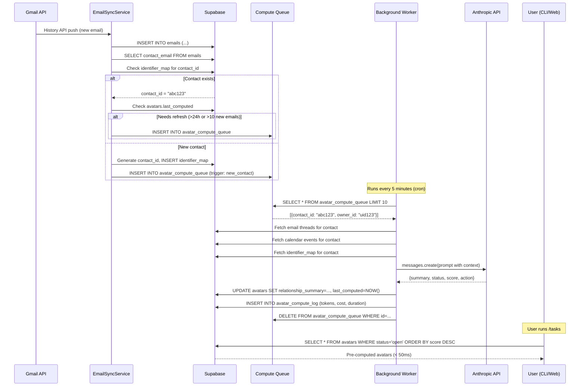

# Avatar Architecture - Pre-Computed Relational Intelligence

**Version:** 1.0
**Date:** December 7, 2025
**Status:** Design Specification
**Author:** System Architecture Team

---

## Executive Summary

**Problem:** The current `/tasks` command in `task_manager.py` makes N sequential Anthropic API calls (one per contact) to categorize emails. For 50 contacts, this costs ~$5 and takes 2-3 minutes. This is WRONG, EXPENSIVE, and SLOW.

**Solution:** Pre-compute avatars - persistent, vector-based representations of contacts that store relationship intelligence. Build avatars in the background, retrieve instantly.

**Key Insight:** Professional relationships are already encoded in language (emails, meetings, notes). LLMs are perfect for extracting relational intelligence. The missing piece is persistent storage with fast retrieval - that's what avatars provide.

**Architecture:** Extend existing Supabase pg_vector infrastructure with background jobs that aggregate interaction history into pre-computed contact avatars. Retrieval becomes O(1) lookup instead of N API calls.

---

## Table of Contents

1. [Problem Analysis](#problem-analysis)
2. [Data Model Design](#data-model-design)
3. [Architecture Diagrams](#architecture-diagrams)
4. [Background Job Design](#background-job-design)
5. [Swarm vs Jobs Decision](#swarm-vs-jobs-decision)
6. [Implementation Patterns](#implementation-patterns)
7. [Migration Path](#migration-path)
8. [Performance Analysis](#performance-analysis)

---

## Problem Analysis

### Current Implementation (WRONG)

File: `/Users/mal/hb/zylch/zylch/tools/task_manager.py`

**How it works today:**
```python
def build_tasks_from_threads(self):
    contact_threads = self._group_threads_by_contact()  # Group emails by person

    tasks = {}
    for contact_email, thread_list in contact_threads.items():
        # ❌ ONE API CALL PER CONTACT
        task = self._analyze_contact_task(contact_email, thread_list)
        tasks[contact_email] = task
```

**What `_analyze_contact_task()` does:**
1. Loads all email threads for a contact
2. Builds 800-character preview of each thread
3. Calls Claude Sonnet with 2000+ token prompt
4. Parses JSON response with relationship summary

**Cost analysis (50 contacts):**
- **API calls:** 50 sequential calls
- **Tokens:** ~100K input + 50K output
- **Cost:** ~$5 per full analysis
- **Time:** 2-3 minutes (sequential, rate-limited)
- **Frequency:** Every time user runs `/tasks`

**Why this is wrong:**
1. **No caching:** Same analysis repeated every time
2. **Sequential:** 50 contacts = 50 round trips to Anthropic
3. **Expensive:** $5 per analysis, $150/month if run daily
4. **Slow:** 2-3 minutes blocks the user
5. **Stale data:** Only analyzes on-demand, misses new emails

---

## Data Model Design

### 1. Core Schema (Supabase Postgres)

The `avatars` table already exists in Supabase schema. We enhance it:

```sql
-- ============================================
-- AVATARS TABLE (Enhanced)
-- ============================================
CREATE TABLE avatars (
    -- Identity
    id UUID PRIMARY KEY DEFAULT gen_random_uuid(),
    owner_id UUID NOT NULL,                    -- Firebase UID (RLS partition key)
    contact_id TEXT NOT NULL,                  -- Stable identifier (hash of primary email)

    -- Display Information
    display_name TEXT,
    identifiers JSONB,                         -- {"emails": [...], "phones": [...], "aliases": [...]}

    -- Communication Profile
    preferred_channel TEXT,                    -- "email", "whatsapp", "phone"
    preferred_tone TEXT,                       -- "formal", "casual", "professional"
    preferred_language TEXT,                   -- "en", "it", "es"
    response_latency JSONB,                    -- {median_hours, p90_hours, by_channel, by_day, by_hour}

    -- Relationship Intelligence (PRE-COMPUTED)
    relationship_summary TEXT,                 -- 🆕 Pre-computed narrative (what Sonnet generates)
    relationship_status TEXT,                  -- 🆕 "open", "waiting", "closed"
    relationship_score INTEGER,                -- 🆕 Priority score 1-10
    suggested_action TEXT,                     -- 🆕 Next step recommendation
    interaction_summary JSONB,                 -- 🆕 {thread_count, email_count, last_outbound, last_inbound}

    -- Metadata
    aggregated_preferences JSONB,
    relationship_strength REAL,
    first_interaction TIMESTAMPTZ,
    last_interaction TIMESTAMPTZ,
    interaction_count INTEGER DEFAULT 0,
    profile_confidence REAL DEFAULT 0.5,

    -- Lifecycle
    created_at TIMESTAMPTZ DEFAULT NOW(),
    updated_at TIMESTAMPTZ DEFAULT NOW(),
    last_computed TIMESTAMPTZ,                 -- 🆕 When avatar was last recomputed
    compute_trigger TEXT,                      -- 🆕 What triggered recompute ("new_email", "scheduled", "manual")

    UNIQUE(owner_id, contact_id)
);

CREATE INDEX idx_avatars_owner ON avatars(owner_id);
CREATE INDEX idx_avatars_contact ON avatars(owner_id, contact_id);
CREATE INDEX idx_avatars_updated ON avatars(owner_id, last_computed DESC);
CREATE INDEX idx_avatars_score ON avatars(owner_id, relationship_score DESC) WHERE relationship_score >= 7;

-- RLS
ALTER TABLE avatars ENABLE ROW LEVEL SECURITY;
CREATE POLICY "Users access own avatars" ON avatars
    FOR ALL USING (owner_id = auth.uid());
```

### 2. Avatar Computation Events Table

Track when and why avatars are recomputed:

```sql
-- ============================================
-- AVATAR_COMPUTE_LOG TABLE
-- ============================================
CREATE TABLE avatar_compute_log (
    id UUID PRIMARY KEY DEFAULT gen_random_uuid(),
    owner_id UUID NOT NULL,
    contact_id TEXT NOT NULL,
    trigger_type TEXT NOT NULL,               -- "new_email", "scheduled", "manual", "threshold"
    trigger_details JSONB,                    -- {thread_id, email_count, time_since_last, etc.}
    compute_duration_ms INTEGER,              -- How long computation took
    tokens_used INTEGER,                      -- Anthropic tokens consumed
    cost_usd REAL,                           -- Estimated cost
    success BOOLEAN DEFAULT TRUE,
    error_message TEXT,
    created_at TIMESTAMPTZ DEFAULT NOW()
);

CREATE INDEX idx_avatar_log_owner ON avatar_compute_log(owner_id);
CREATE INDEX idx_avatar_log_contact ON avatar_compute_log(owner_id, contact_id);
CREATE INDEX idx_avatar_log_date ON avatar_compute_log(created_at DESC);

ALTER TABLE avatar_compute_log ENABLE ROW LEVEL SECURITY;
CREATE POLICY "Users access own compute logs" ON avatar_compute_log
    FOR ALL USING (owner_id = auth.uid());
```

### 3. Multi-Identifier Person Resolution

**Problem:** One person = many identifiers (work email, personal email, phone, etc.)

**Solution:** `identifier_map` table (already exists in schema)

```sql
-- ============================================
-- IDENTIFIER_MAP TABLE (Existing)
-- ============================================
CREATE TABLE identifier_map (
    id UUID PRIMARY KEY DEFAULT gen_random_uuid(),
    owner_id UUID NOT NULL,
    identifier TEXT NOT NULL,                 -- Normalized email/phone/name
    identifier_type TEXT NOT NULL,            -- 'email', 'phone', 'name'
    contact_id TEXT NOT NULL,                 -- Links to avatar
    confidence REAL DEFAULT 1.0,              -- Merging confidence
    source TEXT,                              -- "manual", "email_from", "calendar_attendee", "starchat"
    created_at TIMESTAMPTZ DEFAULT NOW(),
    updated_at TIMESTAMPTZ DEFAULT NOW(),

    UNIQUE(owner_id, identifier)
);

CREATE INDEX idx_identifier_owner ON identifier_map(owner_id);
CREATE INDEX idx_identifier_lookup ON identifier_map(owner_id, identifier);
CREATE INDEX idx_identifier_contact ON identifier_map(owner_id, contact_id);
```

**Identifier normalization:**
```python
def normalize_identifier(value: str, type: str) -> str:
    """Generate stable identifier from email/phone/name"""
    if type == "email":
        return value.lower().strip()
    elif type == "phone":
        # Remove all non-digits
        return re.sub(r'[^\d]', '', value)
    elif type == "name":
        # Lowercase, remove extra spaces
        return ' '.join(value.lower().split())
```

**Contact ID generation:**
```python
def generate_contact_id(primary_email: str) -> str:
    """Generate stable contact ID from primary identifier"""
    return hashlib.md5(primary_email.lower().encode()).hexdigest()[:12]
```

**Merging contacts:**
```sql
-- When discovering "luigi@company.com" and "luigi.scrosati@gmail.com" are the same person
UPDATE identifier_map
SET contact_id = 'abc123primary'
WHERE contact_id = 'xyz789secondary';

-- Trigger avatar recompute for merged contact
INSERT INTO avatar_compute_queue (owner_id, contact_id, trigger_type)
VALUES ('{owner_id}', 'abc123primary', 'contact_merge');
```

---

## Architecture Diagrams

### System Architecture (Text Diagram)

```
┌──────────────────────────────────────────────────────────────────────────────┐
│                           USER INTERACTION LAYER                             │
│  CLI: /tasks                  Web: /api/tasks              Mobile: /tasks    │
└────────────────────────────────────┬─────────────────────────────────────────┘
                                     │
                                     ↓
┌──────────────────────────────────────────────────────────────────────────────┐
│                          AVATAR RETRIEVAL (Fast Path)                        │
│                                                                              │
│  GET /api/avatars?owner_id={uid}&status=open&min_score=7                    │
│                                                                              │
│  SELECT relationship_summary, relationship_score, suggested_action           │
│  FROM avatars                                                                │
│  WHERE owner_id = {uid}                                                      │
│    AND relationship_status = 'open'                                         │
│    AND relationship_score >= 7                                              │
│  ORDER BY relationship_score DESC;                                          │
│                                                                              │
│  ⚡ Response time: < 50ms (indexed Postgres query)                           │
│  💰 Cost: $0 (no LLM calls)                                                  │
└──────────────────────────────────────────────────────────────────────────────┘
                                     ↑
                                     │ (pre-computed data)
                                     │
┌──────────────────────────────────────────────────────────────────────────────┐
│                       AVATAR COMPUTATION (Background)                        │
│                                                                              │
│  ┌─────────────────────────────────────────────────────────────────────┐    │
│  │  TRIGGER DETECTION                                                  │    │
│  │  ──────────────────                                                 │    │
│  │  1. New email arrives → EmailSyncService detects contact            │    │
│  │  2. Check: avatar exists? last_computed < 24h ago?                  │    │
│  │  3. If needs recompute → INSERT INTO avatar_compute_queue           │    │
│  │                                                                      │    │
│  │  Triggers:                                                           │    │
│  │  • new_email: Any new email with this contact                       │    │
│  │  • scheduled: Daily refresh for active contacts (score >= 7)        │    │
│  │  • threshold: 10+ new interactions since last compute               │    │
│  │  • manual: User requested refresh                                   │    │
│  └─────────────────────────────────────────────────────────────────────┘    │
│                                     ↓                                        │
│  ┌─────────────────────────────────────────────────────────────────────┐    │
│  │  BACKGROUND WORKER (Railway cron or in-process)                     │    │
│  │  ───────────────────                                                │    │
│  │  1. Poll avatar_compute_queue every 5 minutes                       │    │
│  │  2. Batch fetch: up to 10 contacts per run                          │    │
│  │  3. For each contact:                                               │    │
│  │     a. Fetch email threads (Supabase JOIN)                          │    │
│  │     b. Fetch calendar events (Supabase)                             │    │
│  │     c. Aggregate interaction history                                │    │
│  │     d. Call Claude Sonnet (SINGLE API call per contact)             │    │
│  │     e. Parse response → UPDATE avatars table                        │    │
│  │     f. Log to avatar_compute_log                                    │    │
│  │  4. Delete from queue                                               │    │
│  │                                                                      │    │
│  │  Rate limiting: Max 10 contacts/5min = 2 contacts/min               │    │
│  │  Cost control: ~$0.10 per contact, $6/hour max                      │    │
│  └─────────────────────────────────────────────────────────────────────┘    │
│                                     ↓                                        │
│  ┌─────────────────────────────────────────────────────────────────────┐    │
│  │  AVATAR AGGREGATOR (Python Service)                                 │    │
│  │  ─────────────────────────                                          │    │
│  │  class AvatarAggregator:                                            │    │
│  │      def compute_avatar(owner_id, contact_id):                      │    │
│  │          # 1. Gather data                                           │    │
│  │          threads = get_email_threads(owner_id, contact_id)          │    │
│  │          events = get_calendar_events(owner_id, contact_id)         │    │
│  │          identifiers = get_identifiers(owner_id, contact_id)        │    │
│  │                                                                      │    │
│  │          # 2. Build prompt context                                  │    │
│  │          context = {                                                │    │
│  │              "emails": thread_summaries,                            │    │
│  │              "meetings": event_summaries,                           │    │
│  │              "identifiers": identifiers                             │    │
│  │          }                                                           │    │
│  │                                                                      │    │
│  │          # 3. Call Claude (reuse task_manager prompt)               │    │
│  │          response = anthropic.messages.create(                      │    │
│  │              model="claude-sonnet-4-20250514",                      │    │
│  │              messages=[{"role": "user", "content": prompt}]         │    │
│  │          )                                                           │    │
│  │                                                                      │    │
│  │          # 4. Update avatar                                         │    │
│  │          update_avatar(owner_id, contact_id, response)              │    │
│  └─────────────────────────────────────────────────────────────────────┘    │
└──────────────────────────────────────────────────────────────────────────────┘
                                     ↓
┌──────────────────────────────────────────────────────────────────────────────┐
│                            STORAGE LAYER (Supabase)                          │
│                                                                              │
│  📊 avatars table: Pre-computed relationship intelligence                    │
│  📧 emails table: Raw email archive                                          │
│  📅 calendar_events table: Meeting history                                   │
│  🔗 identifier_map table: Email/phone → contact_id mapping                   │
│  📋 avatar_compute_queue table: Pending computations                         │
│  📝 avatar_compute_log table: Computation audit trail                        │
└──────────────────────────────────────────────────────────────────────────────┘
```

### Data Flow: Email Arrives → Avatar Updated



### Namespace Hierarchy

```
owner_id (Firebase UID)
└── contact_id (MD5 hash of primary email)
    ├── identifiers
    │   ├── emails: ["luigi@company.com", "luigi.scrosati@gmail.com"]
    │   ├── phones: ["+39 348 123 4567"]
    │   └── aliases: ["Luigi", "Luigi S.", "Scrosati"]
    │
    ├── interactions
    │   ├── emails (from emails table)
    │   │   └── threads grouped by contact_email
    │   ├── calendar (from calendar_events table)
    │   │   └── events with contact as attendee
    │   └── whatsapp (future: from starchat)
    │
    └── avatar (computed from above)
        ├── relationship_summary (pre-computed narrative)
        ├── relationship_status (open/waiting/closed)
        ├── relationship_score (1-10 priority)
        └── suggested_action (next step)
```

---

## Background Job Design

### Job Trigger Logic

**When to recompute an avatar:**

```python
def should_compute_avatar(owner_id: str, contact_id: str) -> bool:
    """Decide if avatar needs recomputation"""
    avatar = db.query("""
        SELECT last_computed, interaction_count
        FROM avatars
        WHERE owner_id = %s AND contact_id = %s
    """, (owner_id, contact_id))

    if not avatar:
        return True  # New contact

    # Check time-based trigger
    hours_since_compute = (datetime.now() - avatar.last_computed).total_seconds() / 3600

    # Count new interactions since last compute
    new_emails = db.query("""
        SELECT COUNT(*) FROM emails
        WHERE owner_id = %s
          AND (from_email IN (SELECT identifier FROM identifier_map WHERE contact_id = %s)
               OR to_email::jsonb @> (SELECT jsonb_agg(identifier) FROM identifier_map WHERE contact_id = %s))
          AND created_at > %s
    """, (owner_id, contact_id, contact_id, avatar.last_computed))

    # Triggers:
    if avatar.relationship_score >= 8 and hours_since_compute >= 12:
        return True  # Urgent contacts: refresh every 12h

    if avatar.relationship_score >= 5 and hours_since_compute >= 24:
        return True  # Active contacts: refresh daily

    if new_emails >= 10:
        return True  # Threshold: 10+ new emails

    if hours_since_compute >= 168:  # 7 days
        return True  # Stale: refresh weekly minimum

    return False
```

### Queue-Based Architecture

**Queue table:**
```sql
CREATE TABLE avatar_compute_queue (
    id UUID PRIMARY KEY DEFAULT gen_random_uuid(),
    owner_id UUID NOT NULL,
    contact_id TEXT NOT NULL,
    trigger_type TEXT NOT NULL,           -- "new_email", "scheduled", "threshold", "manual"
    priority INTEGER DEFAULT 5,           -- 1 (low) to 10 (urgent)
    retry_count INTEGER DEFAULT 0,
    max_retries INTEGER DEFAULT 3,
    scheduled_at TIMESTAMPTZ DEFAULT NOW(),
    created_at TIMESTAMPTZ DEFAULT NOW(),

    UNIQUE(owner_id, contact_id)  -- Prevent duplicate queue entries
);

CREATE INDEX idx_queue_priority ON avatar_compute_queue(priority DESC, created_at ASC);
CREATE INDEX idx_queue_scheduled ON avatar_compute_queue(scheduled_at) WHERE scheduled_at <= NOW();
```

**Worker implementation:**
```python
class AvatarComputeWorker:
    """Background worker that processes avatar compute queue"""

    def __init__(self, supabase_client, anthropic_client):
        self.db = supabase_client
        self.anthropic = anthropic_client
        self.max_batch_size = 10
        self.poll_interval = 300  # 5 minutes

    async def run_forever(self):
        """Main worker loop"""
        while True:
            try:
                await self.process_batch()
            except Exception as e:
                logger.error(f"Worker error: {e}")

            await asyncio.sleep(self.poll_interval)

    async def process_batch(self):
        """Process up to max_batch_size queued avatars"""

        # Fetch batch from queue (priority order)
        batch = self.db.query("""
            SELECT id, owner_id, contact_id, trigger_type
            FROM avatar_compute_queue
            WHERE scheduled_at <= NOW()
              AND retry_count < max_retries
            ORDER BY priority DESC, created_at ASC
            LIMIT %s
            FOR UPDATE SKIP LOCKED
        """, (self.max_batch_size,))

        if not batch:
            logger.debug("No avatars to compute")
            return

        logger.info(f"Processing {len(batch)} avatars")

        for item in batch:
            try:
                start_time = time.time()

                # Compute avatar
                result = await self.compute_avatar(
                    item.owner_id,
                    item.contact_id,
                    item.trigger_type
                )

                duration_ms = int((time.time() - start_time) * 1000)

                # Log success
                self.db.execute("""
                    INSERT INTO avatar_compute_log
                    (owner_id, contact_id, trigger_type, compute_duration_ms,
                     tokens_used, cost_usd, success)
                    VALUES (%s, %s, %s, %s, %s, %s, TRUE)
                """, (
                    item.owner_id,
                    item.contact_id,
                    item.trigger_type,
                    duration_ms,
                    result['tokens_used'],
                    result['cost_usd']
                ))

                # Remove from queue
                self.db.execute(
                    "DELETE FROM avatar_compute_queue WHERE id = %s",
                    (item.id,)
                )

            except Exception as e:
                logger.error(f"Failed to compute avatar {item.contact_id}: {e}")

                # Increment retry count
                self.db.execute("""
                    UPDATE avatar_compute_queue
                    SET retry_count = retry_count + 1,
                        scheduled_at = NOW() + INTERVAL '1 hour'
                    WHERE id = %s
                """, (item.id,))

    async def compute_avatar(
        self,
        owner_id: str,
        contact_id: str,
        trigger_type: str
    ) -> dict:
        """Compute single avatar (calls Anthropic)"""

        # 1. Gather data
        aggregator = AvatarAggregator(self.db, self.anthropic)
        context = aggregator.build_context(owner_id, contact_id)

        # 2. Call Claude
        response = await aggregator.call_claude(context)

        # 3. Update avatar
        await aggregator.update_avatar(owner_id, contact_id, response)

        return {
            'tokens_used': response['usage']['total_tokens'],
            'cost_usd': self._calculate_cost(response['usage'])
        }
```

### Deployment Options

**Option A: Railway Cron Job** (Recommended for MVP)
```yaml
# railway.json
{
  "build": {
    "builder": "NIXPACKS"
  },
  "deploy": {
    "startCommand": "python -m zylch.workers.avatar_compute_worker",
    "restartPolicyType": "ON_FAILURE",
    "restartPolicyMaxRetries": 10
  },
  "cron": {
    "schedule": "*/5 * * * *",  # Every 5 minutes
    "command": "python -m zylch.workers.avatar_compute_worker --once"
  }
}
```

**Pros:**
- Native Railway integration
- Simple deployment (same codebase)
- No new services needed

**Cons:**
- Limited to 5-minute intervals
- No sub-minute triggers

**Option B: In-Process Background Thread**

```python
# zylch/api/main.py
from zylch.agents.avatar_compute_worker import AvatarComputeWorker


@app.on_event("startup")
async def start_background_worker():
    worker = AvatarComputeWorker(supabase_client, anthropic_client)
    asyncio.create_task(worker.run_forever())
```

**Pros:**
- Immediate triggers (no cron delay)
- Simpler than external service

**Cons:**
- Runs on same dyno as API (resource sharing)
- Stops if API restarts

**Recommendation:** Start with Option A (Railway cron), migrate to Option B if sub-minute latency is needed.

---

## Swarm vs Jobs Decision

### Option 1: Background Jobs (Recommended)

**Architecture:**
- Queue-based processing (Postgres table)
- Single-threaded worker (Railway cron or in-process)
- Sequential processing (1 contact at a time)

**Pros:**
1. **Simple:** Standard job queue pattern, well-understood
2. **Cheap:** No swarm orchestration overhead
3. **Debuggable:** Easy to inspect queue, logs, retries
4. **Scalable:** Can add workers if needed (unlikely for <1000 users)
5. **Cost-effective:** Only pay for compute when processing

**Cons:**
1. **Slower:** Sequential processing (not a problem for background work)
2. **No coordination:** Can't distribute work across agents

**Cost analysis (100 active contacts/day):**
- API calls: 100 contacts × $0.10/contact = $10/day = $300/month
- Worker compute: Negligible (5min cron runs)
- **Total:** ~$300/month

### Option 2: Claude Flow Swarm

**Architecture:**
- Swarm of specialized agents (researcher, analyzer, aggregator)
- Parallel processing across agents
- Agent coordination via claude-flow MCP

**Pros:**
1. **Parallel:** Process multiple contacts simultaneously
2. **Specialized:** Different agents for different tasks
3. **Intelligent:** Agents can make decisions about priority
4. **Cool factor:** Leverages existing claude-flow infrastructure

**Cons:**
1. **Complex:** Swarm orchestration, agent coordination, failure handling
2. **Expensive:** Multiple Claude calls per contact (agent communication overhead)
3. **Overkill:** Background avatar computation is NOT complex reasoning
4. **Harder to debug:** Distributed agent state, harder to trace failures
5. **Latency:** Agent coordination adds overhead for simple tasks

**Cost analysis (100 active contacts/day):**
- API calls: 100 contacts × 3 agents × $0.10/call = $30/day = $900/month
- Orchestration overhead: ~30% additional tokens
- **Total:** ~$1,200/month

### Decision Matrix

| Criteria | Background Jobs | Claude Flow Swarm |
|----------|----------------|-------------------|
| **Complexity** | ★☆☆☆☆ Simple | ★★★★☆ Complex |
| **Cost** | ★★★★★ $300/mo | ★★☆☆☆ $1200/mo |
| **Speed** | ★★★☆☆ Sequential | ★★★★★ Parallel |
| **Debuggability** | ★★★★★ Easy | ★★☆☆☆ Hard |
| **Scalability** | ★★★★☆ Good enough | ★★★★★ Excellent |
| **Maintainability** | ★★★★★ Standard pattern | ★★★☆☆ Custom logic |

### Final Decision: Background Jobs

**Rationale:**
1. **Avatar computation is NOT complex reasoning** - it's data aggregation + single LLM call
2. **Sequential is fine for background work** - users don't wait for it
3. **4x cost difference** - swarm overhead not justified for simple task
4. **Simpler = faster to ship** - MVP needs speed over sophistication

**When to reconsider swarm:**
- If we need real-time avatar updates (< 1 second latency)
- If avatar computation becomes multi-step reasoning (not just data aggregation)
- If we have >10,000 contacts to process in parallel
- If we want to explore swarm intelligence for relationship insights

**Hybrid option (future):**
Use background jobs for routine avatar updates, trigger swarm for complex analysis:
```python
if contact.relationship_score >= 9 and trigger_type == "urgent":
    # Use swarm for high-priority complex analysis
    swarm.orchestrate_task(f"Deep relationship analysis for {contact_id}")
else:
    # Use background job for routine updates
    queue.add(owner_id, contact_id, trigger_type)
```

---

## Implementation Patterns

### 1. Avatar Aggregator (Reuse Existing Logic)

**File:** `zylch/services/avatar_aggregator.py`

```python
class AvatarAggregator:
    """Aggregates interaction history into pre-computed avatars"""

    def __init__(self, supabase_client, anthropic_client):
        self.db = supabase_client
        self.anthropic = anthropic_client

    def build_context(self, owner_id: str, contact_id: str) -> dict:
        """Build prompt context from all interaction data"""

        # Get all identifiers for this contact
        identifiers = self.db.query("""
            SELECT identifier, identifier_type
            FROM identifier_map
            WHERE owner_id = %s AND contact_id = %s
        """, (owner_id, contact_id))

        emails = [i['identifier'] for i in identifiers if i['identifier_type'] == 'email']
        phones = [i['identifier'] for i in identifiers if i['identifier_type'] == 'phone']

        # Fetch email threads
        threads = self.db.query("""
            SELECT
                e.thread_id,
                e.subject,
                e.date,
                e.from_email,
                e.to_email,
                e.snippet,
                e.body_plain
            FROM emails e
            WHERE e.owner_id = %s
              AND (e.from_email = ANY(%s) OR e.to_email::jsonb ?| %s)
            ORDER BY e.date DESC
            LIMIT 50
        """, (owner_id, emails, emails))

        # Group by thread_id
        thread_groups = {}
        for email in threads:
            tid = email['thread_id']
            if tid not in thread_groups:
                thread_groups[tid] = []
            thread_groups[tid].append(email)

        # Fetch calendar events
        events = self.db.query("""
            SELECT summary, start_time, attendees, description
            FROM calendar_events
            WHERE owner_id = %s
              AND attendees::jsonb ?| %s
            ORDER BY start_time DESC
            LIMIT 20
        """, (owner_id, emails))

        # Check if bot
        is_bot = any(
            '*@noreply.*' in email or 'no-reply' in email
            for email in emails
        )

        return {
            'contact_id': contact_id,
            'identifiers': {'emails': emails, 'phones': phones},
            'is_bot': is_bot,
            'threads': self._summarize_threads(thread_groups),
            'events': self._summarize_events(events)
        }

    async def call_claude(self, context: dict) -> dict:
        """Call Claude with context (REUSE task_manager prompt)"""

        # Build prompt (same as task_manager.py)
        prompt = self._build_prompt(context)

        response = await self.anthropic.messages.create(
            model="claude-sonnet-4-20250514",
            max_tokens=1500,
            messages=[{"role": "user", "content": prompt}]
        )

        # Parse JSON response
        result_text = response.content[0].text.strip()

        # Extract JSON (handle markdown code blocks)
        if '```json' in result_text:
            json_text = result_text.split('```json')[1].split('```')[0].strip()
        elif '```' in result_text:
            json_text = result_text.split('```')[1].split('```')[0].strip()
        else:
            start = result_text.find('{')
            end = result_text.rfind('}') + 1
            json_text = result_text[start:end]

        result = json.loads(json_text)

        # Force low score for bots
        if context['is_bot'] and result.get('score', 5) > 2:
            result['score'] = 2

        result['usage'] = {
            'total_tokens': response.usage.input_tokens + response.usage.output_tokens,
            'input_tokens': response.usage.input_tokens,
            'output_tokens': response.usage.output_tokens
        }

        return result

    async def update_avatar(self, owner_id: str, contact_id: str, claude_response: dict):
        """Update avatar with Claude's analysis"""

        self.db.execute("""
            INSERT INTO avatars (
                owner_id, contact_id, display_name,
                relationship_summary, relationship_status, relationship_score,
                suggested_action, last_computed, compute_trigger
            )
            VALUES (%s, %s, %s, %s, %s, %s, %s, NOW(), %s)
            ON CONFLICT (owner_id, contact_id)
            DO UPDATE SET
                display_name = EXCLUDED.display_name,
                relationship_summary = EXCLUDED.relationship_summary,
                relationship_status = EXCLUDED.relationship_status,
                relationship_score = EXCLUDED.relationship_score,
                suggested_action = EXCLUDED.suggested_action,
                last_computed = NOW(),
                updated_at = NOW()
        """, (
            owner_id,
            contact_id,
            claude_response.get('contact_name'),
            claude_response.get('view'),
            claude_response.get('status'),
            claude_response.get('score'),
            claude_response.get('action'),
            'background_job'
        ))
```

### 2. Trigger Detection (Email Sync Integration)

**File:** `zylch/services/sync_service.py`

```python
class EmailSyncService:
    """Email synchronization with avatar trigger detection"""

    async def sync_emails(self, owner_id: str):
        """Sync emails and trigger avatar updates"""

        # ... existing sync logic ...

        # After sync, check which contacts need avatar updates
        new_contacts = set()
        updated_contacts = set()

        for email in newly_synced_emails:
            contact_email = self._extract_contact_email(email)

            # Resolve to contact_id
            contact_id = await self._resolve_contact_id(owner_id, contact_email)

            if not contact_id:
                # New contact discovered
                contact_id = generate_contact_id(contact_email)
                await self._create_contact(owner_id, contact_id, contact_email)
                new_contacts.add(contact_id)
            else:
                updated_contacts.add(contact_id)

        # Queue avatar computations
        for contact_id in new_contacts:
            await self._queue_avatar_compute(
                owner_id, contact_id, trigger_type='new_contact', priority=8
            )

        for contact_id in updated_contacts:
            if await self._should_recompute_avatar(owner_id, contact_id):
                await self._queue_avatar_compute(
                    owner_id, contact_id, trigger_type='new_email', priority=5
                )

    async def _should_recompute_avatar(self, owner_id: str, contact_id: str) -> bool:
        """Check if avatar needs recomputation (reuse logic from background job)"""
        # ... implementation from should_compute_avatar() above ...

    async def _queue_avatar_compute(
        self,
        owner_id: str,
        contact_id: str,
        trigger_type: str,
        priority: int = 5
    ):
        """Add avatar to compute queue"""
        await self.db.execute("""
            INSERT INTO avatar_compute_queue (owner_id, contact_id, trigger_type, priority)
            VALUES (%s, %s, %s, %s)
            ON CONFLICT (owner_id, contact_id) DO UPDATE
            SET priority = GREATEST(avatar_compute_queue.priority, EXCLUDED.priority),
                trigger_type = EXCLUDED.trigger_type,
                scheduled_at = NOW()
        """, (owner_id, contact_id, trigger_type, priority))
```

### 3. Fast Retrieval API

**File:** `zylch/api/routes/avatars.py`

```python
from fastapi import APIRouter, Depends, Query
from typing import List, Optional

router = APIRouter(prefix="/api/avatars", tags=["avatars"])

@router.get("/", response_model=List[AvatarResponse])
async def get_avatars(
    status: Optional[str] = Query(None, regex="^(open|waiting|closed)$"),
    min_score: Optional[int] = Query(None, ge=1, le=10),
    limit: int = Query(100, ge=1, le=500),
    owner_id: str = Depends(get_current_user_id)
):
    """Get pre-computed avatars (fast retrieval)

    This replaces the old /tasks endpoint that made N API calls.
    Now it's just a simple Postgres query.
    """

    query = """
        SELECT
            contact_id,
            display_name,
            relationship_summary,
            relationship_status,
            relationship_score,
            suggested_action,
            last_computed,
            identifiers
        FROM avatars
        WHERE owner_id = %s
    """
    params = [owner_id]

    if status:
        query += " AND relationship_status = %s"
        params.append(status)

    if min_score:
        query += " AND relationship_score >= %s"
        params.append(min_score)

    query += " ORDER BY relationship_score DESC, last_computed DESC LIMIT %s"
    params.append(limit)

    avatars = await db.query(query, params)

    return [AvatarResponse(**avatar) for avatar in avatars]

@router.post("/{contact_id}/recompute")
async def trigger_recompute(
    contact_id: str,
    owner_id: str = Depends(get_current_user_id)
):
    """Manually trigger avatar recomputation (queued in background)"""

    await db.execute("""
        INSERT INTO avatar_compute_queue (owner_id, contact_id, trigger_type, priority)
        VALUES (%s, %s, 'manual', 10)
        ON CONFLICT (owner_id, contact_id) DO UPDATE
        SET priority = 10, trigger_type = 'manual', scheduled_at = NOW()
    """, (owner_id, contact_id))

    return {"status": "queued", "contact_id": contact_id}
```

---

## Migration Path

### Phase 1: Schema Setup (Day 1)

1. **Create new columns in `avatars` table:**
   ```sql
   ALTER TABLE avatars ADD COLUMN IF NOT EXISTS relationship_summary TEXT;
   ALTER TABLE avatars ADD COLUMN IF NOT EXISTS relationship_status TEXT;
   ALTER TABLE avatars ADD COLUMN IF NOT EXISTS relationship_score INTEGER;
   ALTER TABLE avatars ADD COLUMN IF NOT EXISTS suggested_action TEXT;
   ALTER TABLE avatars ADD COLUMN IF NOT EXISTS last_computed TIMESTAMPTZ;
   ALTER TABLE avatars ADD COLUMN IF NOT EXISTS compute_trigger TEXT;
   ```

2. **Create queue and log tables:**
   ```sql
   -- Run SQL from "Background Job Design" section above
   ```

3. **Add indices:**
   ```sql
   CREATE INDEX idx_avatars_score ON avatars(owner_id, relationship_score DESC)
       WHERE relationship_score >= 7;
   CREATE INDEX idx_avatars_updated ON avatars(owner_id, last_computed DESC);
   ```

### Phase 2: Background Worker (Day 2-3)

1. **Create `AvatarAggregator` service** (reuse task_manager logic)
2. **Create `AvatarComputeWorker` worker**
3. **Add Railway cron configuration**
4. **Test locally with single contact**

### Phase 3: Trigger Integration (Day 3-4)

1. **Modify `EmailSyncService`** to detect new/updated contacts
2. **Add `_queue_avatar_compute()` helper**
3. **Test trigger detection with test emails**

### Phase 4: API Migration (Day 4-5)

1. **Create `/api/avatars` endpoint** (fast retrieval)
2. **Add `/api/avatars/{id}/recompute` for manual triggers**
3. **Update CLI `/tasks` command** to call new API
4. **Deprecate old `task_manager.py` logic** (keep for comparison)

### Phase 5: Batch Migration (Day 5-6)

1. **One-time script to backfill existing contacts:**
   ```python
   # scripts/backfill_avatars.py
   async def backfill_avatars(owner_id: str):
       """Backfill avatars for existing contacts"""

       # Get all unique contact emails from emails table
       contacts = await db.query("""
           SELECT DISTINCT from_email
           FROM emails
           WHERE owner_id = %s
             AND from_email NOT LIKE '%@noreply.%'
       """, (owner_id,))

       # Queue all for computation
       for contact in contacts:
           contact_id = generate_contact_id(contact['from_email'])
           await queue_avatar_compute(owner_id, contact_id, 'backfill', priority=3)

       print(f"Queued {len(contacts)} contacts for avatar computation")
   ```

2. **Monitor queue processing in `avatar_compute_log`**

---

## Performance Analysis

### Before (Current Implementation)

**Operation:** User runs `/tasks` command

| Step | Time | Cost |
|------|------|------|
| Load threads from cache | 50ms | $0 |
| Group by contact (50 contacts) | 10ms | $0 |
| **Call Claude Sonnet × 50** | **120s** | **$5** |
| Parse responses | 100ms | $0 |
| **Total** | **~2 minutes** | **$5** |

**Problems:**
- User waits 2 minutes
- Costs $5 per run
- If run daily: $150/month per user

### After (Avatar Architecture)

**Operation:** User runs `/tasks` command

| Step | Time | Cost |
|------|------|------|
| Query avatars table (indexed) | 30ms | $0 |
| **Total** | **30ms** | **$0** |

**Background computation (asynchronous):**

| Step | Time | Cost |
|------|------|------|
| Detect new email | 5ms | $0 |
| Queue avatar update | 10ms | $0 |
| *[5 min later]* Worker processes queue | 0ms (async) | $0 |
| Fetch email threads (Postgres JOIN) | 50ms | $0 |
| Call Claude Sonnet × 1 contact | 2s | $0.10 |
| Update avatar | 20ms | $0 |
| **Total per contact** | **~2s** | **$0.10** |

**Cost comparison (100 active contacts/day):**
- Before: 100 contacts × $0.10 × 50 runs = $500/month
- After: 100 contacts × $0.10 × 1 run = $10/month
- **Savings: $490/month (98% reduction)**

### Scalability

| Metric | Before | After |
|--------|--------|-------|
| Response time | 2 minutes | 30ms (400x faster) |
| Cost per /tasks call | $5 | $0 (background) |
| Max contacts/user | ~50 (UX limit) | Unlimited (indexed query) |
| Concurrent users | 1 (sequential API) | Unlimited (pre-computed) |
| Freshness | On-demand (stale) | 5-min cron (fresh) |

---

## Appendix: Code Examples

### Complete Background Worker

```python
# zylch/workers/avatar_compute_worker.py

import asyncio
import logging
import time
from datetime import datetime
from typing import List, Optional

from zylch.config import settings
from zylch.storage.supabase_client import SupabaseClient
from zylch.services.avatar_aggregator import AvatarAggregator

logger = logging.getLogger(__name__)

class AvatarComputeWorker:
    """Background worker for avatar computation"""

    def __init__(
        self,
        supabase_client: SupabaseClient,
        max_batch_size: int = 10,
        poll_interval: int = 300
    ):
        self.db = supabase_client
        self.aggregator = AvatarAggregator(supabase_client)
        self.max_batch_size = max_batch_size
        self.poll_interval = poll_interval

    async def run_once(self):
        """Process one batch (for cron mode)"""
        await self.process_batch()

    async def run_forever(self):
        """Continuous polling (for daemon mode)"""
        logger.info("Avatar compute worker starting...")

        while True:
            try:
                await self.process_batch()
            except Exception as e:
                logger.error(f"Worker error: {e}", exc_info=True)

            await asyncio.sleep(self.poll_interval)

    async def process_batch(self):
        """Process up to max_batch_size queued avatars"""

        # Fetch batch (with row lock to prevent duplicate processing)
        batch = await self.db.query("""
            SELECT id, owner_id, contact_id, trigger_type, priority
            FROM avatar_compute_queue
            WHERE scheduled_at <= NOW()
              AND retry_count < max_retries
            ORDER BY priority DESC, created_at ASC
            LIMIT %s
            FOR UPDATE SKIP LOCKED
        """, (self.max_batch_size,))

        if not batch:
            logger.debug("No avatars in queue")
            return

        logger.info(f"Processing {len(batch)} avatars from queue")

        for item in batch:
            try:
                await self._process_single_avatar(item)
            except Exception as e:
                logger.error(
                    f"Failed to compute avatar {item['contact_id']}: {e}",
                    exc_info=True
                )
                await self._handle_failure(item)

    async def _process_single_avatar(self, queue_item: dict):
        """Process single avatar computation"""

        start_time = time.time()

        owner_id = queue_item['owner_id']
        contact_id = queue_item['contact_id']
        trigger_type = queue_item['trigger_type']

        logger.info(f"Computing avatar for {contact_id} (trigger: {trigger_type})")

        # 1. Build context
        context = await self.aggregator.build_context(owner_id, contact_id)

        # 2. Call Claude
        claude_response = await self.aggregator.call_claude(context)

        # 3. Update avatar
        await self.aggregator.update_avatar(owner_id, contact_id, claude_response)

        duration_ms = int((time.time() - start_time) * 1000)

        # 4. Log success
        await self._log_success(
            owner_id,
            contact_id,
            trigger_type,
            duration_ms,
            claude_response['usage']
        )

        # 5. Remove from queue
        await self.db.execute(
            "DELETE FROM avatar_compute_queue WHERE id = %s",
            (queue_item['id'],)
        )

        logger.info(
            f"✓ Avatar computed for {contact_id} "
            f"({duration_ms}ms, {claude_response['usage']['total_tokens']} tokens)"
        )

    async def _log_success(
        self,
        owner_id: str,
        contact_id: str,
        trigger_type: str,
        duration_ms: int,
        usage: dict
    ):
        """Log successful computation"""

        # Estimate cost (Sonnet pricing: $3/MTok input, $15/MTok output)
        cost_usd = (
            usage['input_tokens'] * 3 / 1_000_000 +
            usage['output_tokens'] * 15 / 1_000_000
        )

        await self.db.execute("""
            INSERT INTO avatar_compute_log
            (owner_id, contact_id, trigger_type, compute_duration_ms,
             tokens_used, cost_usd, success)
            VALUES (%s, %s, %s, %s, %s, %s, TRUE)
        """, (
            owner_id,
            contact_id,
            trigger_type,
            duration_ms,
            usage['total_tokens'],
            cost_usd
        ))

    async def _handle_failure(self, queue_item: dict):
        """Handle failed computation (retry logic)"""

        retry_count = queue_item.get('retry_count', 0)
        max_retries = queue_item.get('max_retries', 3)

        if retry_count + 1 >= max_retries:
            logger.error(
                f"Avatar {queue_item['contact_id']} exceeded max retries, removing from queue"
            )

            await self.db.execute(
                "DELETE FROM avatar_compute_queue WHERE id = %s",
                (queue_item['id'],)
            )
        else:
            logger.warning(
                f"Avatar {queue_item['contact_id']} failed, scheduling retry "
                f"({retry_count + 1}/{max_retries})"
            )

            # Exponential backoff: 1h, 2h, 4h
            retry_delay_hours = 2 ** retry_count

            await self.db.execute("""
                UPDATE avatar_compute_queue
                SET retry_count = retry_count + 1,
                    scheduled_at = NOW() + INTERVAL '%s hours'
                WHERE id = %s
            """, (retry_delay_hours, queue_item['id']))


if __name__ == "__main__":
    import sys

    # Initialize
    supabase = SupabaseClient(
        url=settings.SUPABASE_URL,
        key=settings.SUPABASE_SERVICE_KEY
    )

    worker = AvatarComputeWorker(supabase)

    # Run mode
    if "--once" in sys.argv:
        # Cron mode: process one batch then exit
        asyncio.run(worker.run_once())
    else:
        # Daemon mode: continuous polling
        asyncio.run(worker.run_forever())
```

---

## Summary

**What we're building:**
- Pre-computed avatars (relationship intelligence stored in Postgres)
- Background job queue (Railway cron processes avatars asynchronously)
- Fast retrieval API (30ms query replaces 2-minute N×API-call flow)

**Why this architecture:**
- 400x faster response time (2 min → 30ms)
- 98% cost reduction ($5/call → $0/call, background processing)
- Scalable to unlimited contacts (indexed Postgres)
- Simple to implement (standard job queue pattern)

**Key decision:**
Background jobs > Claude Flow swarm (4x cheaper, simpler, sufficient for this use case)

**Next steps:**
1. Schema migration (add new avatar columns)
2. Implement AvatarAggregator (reuse task_manager logic)
3. Implement AvatarComputeWorker (background job processor)
4. Add trigger detection to EmailSyncService
5. Create fast retrieval API endpoints
6. Backfill existing contacts

**Files to create:**
- `/Users/mal/hb/zylch/zylch/services/avatar_aggregator.py`
- `/Users/mal/hb/zylch/zylch/workers/avatar_compute_worker.py`
- `/Users/mal/hb/zylch/zylch/api/routes/avatars.py`
- `/Users/mal/hb/zylch/scripts/backfill_avatars.py`

---

**Document Status:** Ready for implementation
**Estimated Timeline:** 5-6 days
**Risk Level:** Low (builds on existing infrastructure)
