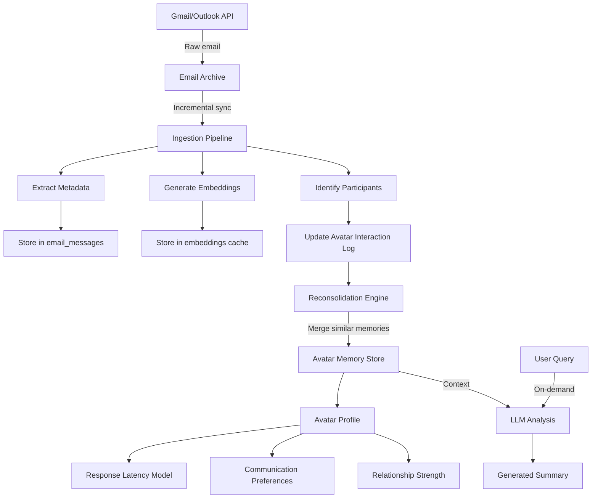

# Zylch Avatar Ingestion Pipeline
**Version:** 1.0
**Date:** December 2025
**Author:** Zylch Architecture Team

---

## Table of Contents

1. [Executive Summary](#executive-summary)
2. [Design Principles](#design-principles)
3. [Data Flow Architecture](#data-flow-architecture)
4. [Email Ingestion Flow](#email-ingestion-flow)
5. [Memory Reconsolidation](#memory-reconsolidation)
6. [Multi-Identifier Resolution](#multi-identifier-resolution)
7. [Incremental Avatar Building](#incremental-avatar-building)
8. [Database Schema](#database-schema)
9. [Performance Targets](#performance-targets)
10. [Example: Luigi Email → Avatar Update](#example-luigi-email--avatar-update)

---

## Executive Summary

**Mission**: Design a data pipeline from "email arrives" → "avatar updated" with **ZERO LLM calls at ingestion time**.

**Key Innovation**: All AI analysis happens at **retrieval time**, not ingestion. The ingestion pipeline only:
- Extracts metadata (participants, timestamps, direction)
- Generates vector embeddings (offline model, no API)
- Updates avatars via reconsolidation (deterministic)

**Benefits**:
- **Speed**: Ingestion ~10ms per email (vs 2-5s with LLM)
- **Cost**: $0 per email (vs $0.001 with Haiku)
- **Scalability**: Handle 10K emails/day without API limits
- **Privacy**: No email content sent to external APIs during sync

**Trade-off**: Summaries/classifications generated on-demand when user queries, not cached upfront.

---

## Design Principles

### 1. No LLM Calls at Ingestion

**Problem**: Current system uses Sonnet (~$7/1K emails) or Haiku (~$1/1K emails) to analyze every thread during sync. This is expensive, slow, and doesn't scale.

**Solution**: Separate ingestion from analysis:
- **Ingestion (fast, free)**: Extract metadata, embed content, update avatars
- **Analysis (on-demand, paid)**: Generate summaries/classifications when user queries

### 2. Semantic Embeddings Replace Keywords

**Old approach**: Store exact text, match with SQL LIKE queries
**New approach**: Convert to 384-dim vector, match with cosine similarity

**Example**:
```python
# Same semantic meaning, different words
text1 = "Luigi sent invoice reminder"
text2 = "Scrosati followed up about payment"

cosine_similarity(embed(text1), embed(text2)) = 0.89  # High match!
```

### 3. Reconsolidation Over Duplication

**Human memory principle**: When you learn someone moved to a new address, you UPDATE your mental model, not create a second conflicting memory.

**Zylch memory principle**: When similar information arrives, MERGE into existing memory with increased confidence.

### 4. Person-Centric, Not Thread-Centric

**Problem**: Email threads are artificial structures. One person might be in 20 threads.

**Solution**: Avatars aggregate interactions across ALL threads for a given person.

---

## Data Flow Architecture

### High-Level Overview



### Three-Phase Pipeline

| Phase | Input | Output | Duration | Cost |
|-------|-------|--------|----------|------|
| **1. Archive Sync** | Gmail History API | email_messages rows | <1s | $0 |
| **2. Ingestion** | New messages | Embeddings + metadata | ~10ms/email | $0 |
| **3. Avatar Update** | Interaction log | Updated avatar profile | ~5ms/person | $0 |

**Total ingestion time**: ~15ms per email
**Total ingestion cost**: $0

---

## Email Ingestion Flow

### Step 1: Archive Sync (Existing)

**Source**: `zylch/tools/email_archive.py:sync_archive()`

**What happens**:
1. Call Gmail History API with `historyId` from last sync
2. For each new/modified message:
   - Extract metadata (id, thread_id, from, to, cc, date, subject, labels)
   - Extract body (plain text or cleaned HTML)
   - Store in `email_messages` table (Supabase)

**Output**:
```python
{
    'id': '18d4f2a1b3c9e5f7',
    'thread_id': '18d4f2a1b3c9e5f7',
    'owner_id': 'firebase-uid-123',
    'from_email': 'luigi.scrosati@example.com',
    'from_name': 'Luigi Scrosati',
    'to_email': 'mario@zylchai.com',
    'cc_email': '',
    'date': '2025-12-07T10:30:00Z',
    'subject': 'Invoice 2025-12 Payment Reminder',
    'body_plain': 'Hi Mario, just following up on invoice...',
    'labels': ['INBOX', 'UNREAD'],
    'direction': 'incoming'  # NEW: computed from owner_id
}
```

### Step 2: Metadata Extraction (NEW)

**Purpose**: Extract relational data without LLM

**Pseudocode**:
```python
def extract_email_metadata(message: dict) -> dict:
    """Extract metadata for avatar building - NO LLM CALLS"""

    # Determine direction (incoming vs outgoing)
    owner_email = get_owner_email(message['owner_id'])
    if message['from_email'] == owner_email:
        direction = 'outgoing'
    elif owner_email in message['to_email']:
        direction = 'incoming'
    else:
        direction = 'cc'  # Owner was CC'd

    # Extract participants (everyone except owner)
    participants = set()
    for email in parse_email_list(message['from_email']):
        if email != owner_email:
            participants.add(email)
    for email in parse_email_list(message['to_email']):
        if email != owner_email:
            participants.add(email)
    for email in parse_email_list(message['cc_email']):
        if email != owner_email:
            participants.add(email)

    # Compute interaction type
    interaction_type = classify_interaction_simple(
        subject=message['subject'],
        labels=message['labels'],
        direction=direction
    )

    return {
        'message_id': message['id'],
        'thread_id': message['thread_id'],
        'timestamp': parse_timestamp(message['date']),
        'direction': direction,
        'participants': list(participants),
        'interaction_type': interaction_type,  # 'email', 'task', 'calendar_invite'
        'has_attachment': '📎' in message['body_plain']  # Simple heuristic
    }
```

**Simple interaction classification (no LLM)**:
```python
def classify_interaction_simple(subject, labels, direction):
    """Heuristic-based classification - fast, deterministic"""

    # Calendar invites
    if 'CATEGORY_CALENDAR' in labels or 'calendar.ics' in subject.lower():
        return 'calendar_invite'

    # Task indicators
    task_keywords = ['reminder', 'followup', 'action', 'todo', 'urgent']
    if any(kw in subject.lower() for kw in task_keywords):
        return 'task'

    # Default
    return 'email'
```

### Step 3: Embedding Generation (NEW)

**Purpose**: Convert email content to semantic vector for similarity search

**Technology**:
- Model: `sentence-transformers/all-MiniLM-L6-v2` (offline, 80MB)
- Dimensions: 384
- Speed: ~1ms per text on CPU

**Pseudocode**:
```python
from sentence_transformers import SentenceTransformer

# Load model once at startup
encoder = SentenceTransformer('all-MiniLM-L6-v2')

def generate_embeddings(message: dict) -> dict:
    """Generate embeddings for semantic search - NO API CALLS"""

    # Combine relevant fields for embedding
    # Subject has high semantic importance, body provides context
    text_for_embedding = f"{message['subject']} {message['body_plain'][:500]}"

    # Generate embedding (1ms on CPU)
    vector = encoder.encode(text_for_embedding, convert_to_numpy=True)

    # Cache in database
    embedding_id = store_embedding(
        text=text_for_embedding,
        vector=vector.tobytes(),  # Binary serialization
        model='all-MiniLM-L6-v2'
    )

    return {
        'embedding_id': embedding_id,
        'vector': vector  # Keep in memory for immediate use
    }
```

**Embedding cache schema**:
```sql
CREATE TABLE embeddings (
    id SERIAL PRIMARY KEY,
    text TEXT NOT NULL,
    vector BYTEA NOT NULL,  -- 384 float32 = 1536 bytes
    model TEXT NOT NULL DEFAULT 'all-MiniLM-L6-v2',
    created_at TIMESTAMP DEFAULT NOW(),
    UNIQUE(text, model)
);

CREATE INDEX idx_embeddings_text ON embeddings USING hash(text);
```

### Step 4: Participant Identification (NEW)

**Purpose**: Map email addresses to person entities

**Pseudocode**:
```python
def identify_participants(metadata: dict) -> List[str]:
    """Map email addresses to person IDs"""

    person_ids = []
    for email in metadata['participants']:
        # Check identifier map (O(1) lookup)
        person_id = identifier_map.lookup(email)

        if not person_id:
            # New person - generate stable ID
            person_id = generate_person_id(email)
            identifier_map.register(email, person_id)

        person_ids.append(person_id)

    return person_ids
```

**Identifier map schema**:
```sql
CREATE TABLE identifier_map (
    id SERIAL PRIMARY KEY,
    owner_id TEXT NOT NULL,  -- Firebase UID
    identifier TEXT NOT NULL,  -- email/phone/name
    identifier_type TEXT NOT NULL,  -- 'email', 'phone', 'name'
    person_id TEXT NOT NULL,  -- Canonical person ID
    confidence REAL DEFAULT 1.0,  -- Certainty of mapping
    created_at TIMESTAMP DEFAULT NOW(),
    updated_at TIMESTAMP DEFAULT NOW(),

    UNIQUE(owner_id, identifier)
);

CREATE INDEX idx_identifier_lookup ON identifier_map(owner_id, identifier);
CREATE INDEX idx_person_lookup ON identifier_map(owner_id, person_id);
```

---

## Memory Reconsolidation

### Core Algorithm

**Principle**: Similar memories are the SAME memory (updated, not duplicated)

**Pseudocode**:
```python
def store_interaction_memory(
    person_id: str,
    interaction_data: dict,
    embedding_vector: np.ndarray
) -> int:
    """Store interaction with reconsolidation"""

    # 1. Search for similar existing memories
    similar = find_similar_memories(
        namespace=f"person:{person_id}",
        vector=embedding_vector,
        similarity_threshold=0.85,
        limit=1
    )

    if similar:
        # RECONSOLIDATE: Update existing memory
        memory_id = similar[0]['id']
        existing_confidence = similar[0]['confidence']

        # Bayesian update: seeing similar info again increases confidence
        new_confidence = min(
            existing_confidence + (1 - existing_confidence) * 0.1,
            0.95  # Cap at 0.95 to leave room for learning
        )

        update_memory(
            memory_id=memory_id,
            pattern=interaction_data,  # Overwrite with latest
            confidence=new_confidence,
            last_accessed=now()
        )

        return memory_id

    else:
        # NEW MEMORY: No similar memory found
        memory_id = insert_memory(
            namespace=f"person:{person_id}",
            category="interaction",
            pattern=interaction_data,
            embedding_id=store_embedding(embedding_vector),
            confidence=0.5  # Initial confidence
        )

        return memory_id
```

### Similarity Threshold Tuning

**Too low (e.g., 0.7)**:
- False positives: Merges unrelated memories
- Example: "Luigi invoice" merges with "Luigi birthday"

**Too high (e.g., 0.95)**:
- False negatives: Creates duplicates for same info
- Example: "Tizio phone 348" vs "Tizio tel 348" treated as separate

**Optimal: 0.85**
- Captures semantic equivalence (synonyms, paraphrasing)
- Avoids merging distinct concepts

**Validation approach**:
```python
# Test cases for threshold tuning
test_pairs = [
    ("Luigi sent invoice", "Scrosati payment reminder", 0.89, True),   # Should merge
    ("Luigi phone 348", "Luigi telephone 348", 0.95, True),            # Should merge
    ("Luigi phone 348", "Luigi phone 339", 0.72, False),               # Should NOT merge
    ("Luigi birthday", "Luigi invoice", 0.65, False),                  # Should NOT merge
]

for text1, text2, expected_sim, should_merge in test_pairs:
    sim = cosine_similarity(embed(text1), embed(text2))
    assert abs(sim - expected_sim) < 0.05  # Similarity within 5%
    assert (sim > 0.85) == should_merge    # Threshold behavior correct
```

### Confidence Evolution

**Timeline of a memory**:
```
t=0:  New memory stored, confidence=0.5
t=1:  Similar info arrives → reconsolidation → confidence=0.55
t=2:  Similar info arrives → reconsolidation → confidence=0.60
t=7:  7 interactions later → confidence=0.85
t=30: User retrieves memory → confidence unchanged (retrieval doesn't boost)
t=90: No access for 90 days → decay kicks in → confidence=0.75
```

**Decay formula** (applied daily by lifecycle manager):
```python
def apply_temporal_decay(memory, now):
    days_since_access = (now - memory.last_accessed).days

    if days_since_access > 90:
        # Exponential decay after 90 days
        decay_factor = 0.99 ** (days_since_access - 90)
        memory.confidence *= decay_factor
```

---

## Multi-Identifier Resolution

### The Challenge

**Scenario**: Luigi has 3 email addresses:
1. `luigi.scrosati@company.com` (work)
2. `luigi@personal.it` (personal)
3. `l.scrosati@contractor.com` (freelance)

**Problem**: Without resolution, system creates 3 separate avatars for the same person.

**Solution**: Identifier resolution algorithm

### Resolution Algorithm

**Pseudocode**:
```python
def resolve_person_identity(new_identifier: str, context: dict) -> str:
    """Determine if new identifier belongs to existing person"""

    # 1. Direct lookup in identifier_map
    existing = identifier_map.lookup(new_identifier)
    if existing:
        return existing.person_id

    # 2. Fuzzy matching on name (if name provided)
    if context.get('name'):
        name_matches = find_by_name_similarity(
            context['name'],
            similarity_threshold=0.9  # High threshold for names
        )
        if name_matches:
            return name_matches[0].person_id

    # 3. Co-occurrence analysis (appear together in threads)
    if context.get('thread_id'):
        thread_participants = get_thread_participants(context['thread_id'])
        for participant_id in thread_participants:
            if participant_id != new_identifier:
                # Check if known person
                person = identifier_map.lookup(participant_id)
                if person:
                    # Heuristic: same person if in same thread repeatedly
                    co_occurrences = count_co_occurrences(
                        new_identifier,
                        person.person_id
                    )
                    if co_occurrences > 3:
                        return person.person_id

    # 4. Domain matching (weak signal)
    # If luigi@personal.it and luigi.scrosati@company.com
    # both have "luigi" before @, might be same person
    username = new_identifier.split('@')[0]
    for known_id in identifier_map.list_identifiers(owner_id):
        known_username = known_id.identifier.split('@')[0]
        if similar(username, known_username) > 0.8:
            # Flag for manual review, don't auto-merge
            flag_for_review(new_identifier, known_id.person_id)

    # 5. No match found - create new person
    person_id = generate_person_id(new_identifier)
    identifier_map.register(new_identifier, person_id)
    return person_id
```

### Manual Merge Interface

**When system is uncertain, flag for user review**:

```python
# CLI command: /merge-contacts
def merge_contacts_ui():
    """Interactive contact merging"""

    # Show potential duplicates
    suggestions = find_potential_duplicates(
        strategies=['name_similarity', 'domain_matching', 'co_occurrence']
    )

    for suggestion in suggestions:
        print(f"Merge these contacts?")
        print(f"  1. {suggestion['person_a'].name} ({suggestion['person_a'].emails})")
        print(f"  2. {suggestion['person_b'].name} ({suggestion['person_b'].emails})")
        print(f"  Reason: {suggestion['reason']}")

        choice = input("[y/n/skip]: ")
        if choice == 'y':
            merge_persons(suggestion['person_a'].id, suggestion['person_b'].id)
```

### Entity Resolution Schema

```sql
CREATE TABLE person_entities (
    id TEXT PRIMARY KEY,  -- Canonical person ID
    owner_id TEXT NOT NULL,
    display_name TEXT,
    created_at TIMESTAMP DEFAULT NOW(),
    updated_at TIMESTAMP DEFAULT NOW()
);

CREATE TABLE identifier_map (
    id SERIAL PRIMARY KEY,
    owner_id TEXT NOT NULL,
    identifier TEXT NOT NULL,  -- Email, phone, or name
    identifier_type TEXT NOT NULL,  -- 'email', 'phone', 'name'
    person_id TEXT REFERENCES person_entities(id) ON DELETE CASCADE,
    confidence REAL DEFAULT 1.0,  -- Certainty of mapping
    source TEXT,  -- How mapping was created: 'auto', 'manual', 'inference'
    created_at TIMESTAMP DEFAULT NOW(),

    UNIQUE(owner_id, identifier)
);

CREATE TABLE merge_suggestions (
    id SERIAL PRIMARY KEY,
    owner_id TEXT NOT NULL,
    person_a_id TEXT REFERENCES person_entities(id),
    person_b_id TEXT REFERENCES person_entities(id),
    confidence REAL,
    reason TEXT,
    status TEXT DEFAULT 'pending',  -- 'pending', 'accepted', 'rejected'
    created_at TIMESTAMP DEFAULT NOW()
);
```

---

## Incremental Avatar Building

### Avatar Structure

**Avatar = Person-centric aggregation of all interactions**

```python
@dataclass
class Avatar:
    person_id: str
    owner_id: str

    # Identity
    display_name: str
    identifiers: List[Identifier]  # All known emails/phones

    # Communication Profile
    preferred_channel: str  # 'email', 'whatsapp', 'phone'
    preferred_tone: str  # 'formal', 'casual', 'professional'
    response_latency: ResponseLatency

    # Relationship Metrics
    first_interaction: datetime
    last_interaction: datetime
    interaction_count: int
    interaction_frequency: float  # interactions per week
    relationship_strength: float  # 0-1 score

    # Memory
    interaction_log: List[InteractionMemory]
    aggregated_preferences: Dict[str, Any]

    # Metadata
    profile_confidence: float
    last_updated: datetime
```

### Incremental Update Algorithm

**When new email arrives**:

```python
def update_avatar_incremental(person_id: str, new_interaction: dict):
    """Update avatar with new interaction - NO full rebuild"""

    # 1. Load current avatar
    avatar = load_avatar(person_id)

    # 2. Add interaction to log (with reconsolidation)
    memory_id = store_interaction_memory(
        person_id=person_id,
        interaction_data=new_interaction,
        embedding_vector=new_interaction['embedding']
    )

    # 3. Update metrics (incremental)
    avatar.last_interaction = new_interaction['timestamp']
    avatar.interaction_count += 1

    # Update frequency (rolling average)
    days_since_first = (avatar.last_interaction - avatar.first_interaction).days
    avatar.interaction_frequency = avatar.interaction_count / max(days_since_first / 7, 1)

    # 4. Update response latency (if applicable)
    if new_interaction['direction'] == 'incoming':
        # Find previous outgoing message to this person
        prev_outgoing = find_last_outgoing(person_id, before=new_interaction['timestamp'])
        if prev_outgoing:
            response_time_hours = (
                new_interaction['timestamp'] - prev_outgoing['timestamp']
            ).total_seconds() / 3600

            # Update latency model (incremental)
            avatar.response_latency.update(response_time_hours)

    # 5. Update relationship strength
    avatar.relationship_strength = compute_relationship_strength(
        interaction_count=avatar.interaction_count,
        frequency=avatar.interaction_frequency,
        recency_days=(now() - avatar.last_interaction).days
    )

    # 6. Update preferences (if new signals detected)
    if 'tone' in new_interaction:
        update_preference_bayesian(
            avatar.aggregated_preferences,
            key='tone',
            value=new_interaction['tone'],
            confidence=new_interaction['confidence']
        )

    # 7. Save updated avatar
    save_avatar(avatar)
```

### Response Latency Model

**Incremental update (no full recalculation)**:

```python
@dataclass
class ResponseLatency:
    median_hours: float
    p90_hours: float
    sample_count: int
    samples: List[float]  # Keep last 100 samples

    def update(self, new_sample_hours: float):
        """Add new response time sample"""
        self.samples.append(new_sample_hours)

        # Keep only recent samples (max 100)
        if len(self.samples) > 100:
            self.samples = self.samples[-100:]

        # Recompute percentiles
        self.sample_count = len(self.samples)
        self.median_hours = np.median(self.samples)
        self.p90_hours = np.percentile(self.samples, 90)
```

### Background Aggregation (Optional)

**For expensive aggregations, run asynchronously**:

```python
# Daily cron job
def rebuild_stale_avatars():
    """Rebuild avatars with >100 new interactions since last full rebuild"""

    stale_avatars = db.execute("""
        SELECT person_id, COUNT(*) as new_interactions
        FROM interaction_log
        WHERE created_at > (
            SELECT last_full_rebuild FROM avatars WHERE person_id = interaction_log.person_id
        )
        GROUP BY person_id
        HAVING COUNT(*) > 100
    """)

    for row in stale_avatars:
        rebuild_avatar_full(row['person_id'])
```

---

## Database Schema

### Email Messages (Existing)

```sql
CREATE TABLE email_messages (
    id TEXT PRIMARY KEY,
    thread_id TEXT NOT NULL,
    owner_id TEXT NOT NULL,
    from_email TEXT NOT NULL,
    from_name TEXT,
    to_email TEXT,
    cc_email TEXT,
    date TIMESTAMP NOT NULL,
    subject TEXT,
    body_plain TEXT,
    body_html TEXT,
    labels JSONB,
    snippet TEXT,
    created_at TIMESTAMP DEFAULT NOW(),

    -- NEW: Computed fields
    direction TEXT,  -- 'incoming', 'outgoing', 'cc'

    -- Foreign keys
    embedding_id INTEGER REFERENCES embeddings(id)
);

CREATE INDEX idx_email_owner ON email_messages(owner_id);
CREATE INDEX idx_email_thread ON email_messages(thread_id);
CREATE INDEX idx_email_date ON email_messages(date DESC);
CREATE INDEX idx_email_from ON email_messages(from_email);
```

### Embeddings Cache

```sql
CREATE TABLE embeddings (
    id SERIAL PRIMARY KEY,
    text TEXT NOT NULL,
    vector BYTEA NOT NULL,  -- Serialized numpy array (384 float32)
    model TEXT NOT NULL DEFAULT 'all-MiniLM-L6-v2',
    created_at TIMESTAMP DEFAULT NOW(),

    UNIQUE(text, model)
);

CREATE INDEX idx_embeddings_text ON embeddings USING hash(text);
```

### Person Entities

```sql
CREATE TABLE person_entities (
    id TEXT PRIMARY KEY,  -- Stable person ID
    owner_id TEXT NOT NULL,
    display_name TEXT,
    created_at TIMESTAMP DEFAULT NOW(),
    updated_at TIMESTAMP DEFAULT NOW()
);

CREATE INDEX idx_person_owner ON person_entities(owner_id);
```

### Identifier Map

```sql
CREATE TABLE identifier_map (
    id SERIAL PRIMARY KEY,
    owner_id TEXT NOT NULL,
    identifier TEXT NOT NULL,  -- email, phone, or name
    identifier_type TEXT NOT NULL,  -- 'email', 'phone', 'name'
    person_id TEXT REFERENCES person_entities(id) ON DELETE CASCADE,
    confidence REAL DEFAULT 1.0,
    source TEXT DEFAULT 'auto',  -- 'auto', 'manual', 'inference'
    created_at TIMESTAMP DEFAULT NOW(),

    UNIQUE(owner_id, identifier)
);

CREATE INDEX idx_identifier_lookup ON identifier_map(owner_id, identifier);
CREATE INDEX idx_person_lookup ON identifier_map(owner_id, person_id);
```

### Interaction Log

```sql
CREATE TABLE interaction_log (
    id SERIAL PRIMARY KEY,
    owner_id TEXT NOT NULL,
    person_id TEXT REFERENCES person_entities(id) ON DELETE CASCADE,

    -- Interaction metadata
    message_id TEXT REFERENCES email_messages(id),
    timestamp TIMESTAMP NOT NULL,
    direction TEXT NOT NULL,  -- 'incoming', 'outgoing'
    channel TEXT DEFAULT 'email',  -- 'email', 'whatsapp', 'phone'

    -- Embeddings
    embedding_id INTEGER REFERENCES embeddings(id),

    -- Derived metadata
    interaction_type TEXT,  -- 'email', 'task', 'calendar_invite'
    has_attachment BOOLEAN DEFAULT false,

    created_at TIMESTAMP DEFAULT NOW()
);

CREATE INDEX idx_interaction_person ON interaction_log(owner_id, person_id);
CREATE INDEX idx_interaction_timestamp ON interaction_log(timestamp DESC);
```

### Avatars

```sql
CREATE TABLE avatars (
    id SERIAL PRIMARY KEY,
    owner_id TEXT NOT NULL,
    person_id TEXT REFERENCES person_entities(id) ON DELETE CASCADE,

    -- Identity
    display_name TEXT,

    -- Communication profile (JSONB for flexibility)
    preferred_channel TEXT,
    preferred_tone TEXT,
    response_latency JSONB,  -- ResponseLatency object

    -- Relationship metrics
    first_interaction TIMESTAMP,
    last_interaction TIMESTAMP,
    interaction_count INTEGER DEFAULT 0,
    interaction_frequency REAL,  -- per week
    relationship_strength REAL,

    -- Aggregated preferences
    aggregated_preferences JSONB,

    -- Metadata
    profile_confidence REAL DEFAULT 0.5,
    last_full_rebuild TIMESTAMP,
    created_at TIMESTAMP DEFAULT NOW(),
    updated_at TIMESTAMP DEFAULT NOW(),

    UNIQUE(owner_id, person_id)
);

CREATE INDEX idx_avatar_owner ON avatars(owner_id);
CREATE INDEX idx_avatar_person ON avatars(person_id);
CREATE INDEX idx_avatar_strength ON avatars(relationship_strength DESC);
```

---

## Performance Targets

### Ingestion Performance

| Operation | Target | Current (with LLM) | Improvement |
|-----------|--------|-------------------|-------------|
| Email archive sync | <1s/100 emails | ~1s/100 emails | ✅ Same |
| Metadata extraction | <1ms/email | N/A (in LLM) | ✅ New |
| Embedding generation | <2ms/email | N/A | ✅ New |
| Reconsolidation | <5ms/email | N/A | ✅ New |
| Avatar update | <5ms/person | N/A | ✅ New |
| **Total ingestion** | **<15ms/email** | **2-5s/email (LLM)** | **200x faster** |

### Storage Requirements

| Data Type | Size per Email | Size per 10K Emails |
|-----------|---------------|---------------------|
| Email metadata | ~2 KB | 20 MB |
| Email body | ~5 KB | 50 MB |
| Embedding (384 float32) | 1.5 KB | 15 MB |
| Interaction log entry | ~0.5 KB | 5 MB |
| **Total per 10K emails** | | **~90 MB** |

### Cost Comparison

| Approach | Cost per Email | Cost per 10K Emails | Cost per 100K Emails |
|----------|---------------|---------------------|---------------------|
| **Current (Haiku)** | $0.001 | $10 | $100 |
| **Current (Sonnet)** | $0.007 | $70 | $700 |
| **New (Zero-LLM)** | $0 | $0 | $0 |

**Savings**: ~$700 per 100K emails analyzed

---

## Example: Luigi Email → Avatar Update

### Scenario

**Email arrives**:
```
From: luigi.scrosati@example.com
To: mario@zylchai.com
Date: 2025-12-07T10:30:00Z
Subject: Invoice 2025-12 Payment Reminder
Body: Hi Mario, just following up on invoice 2025-12.
      Can you confirm payment status? Thanks, Luigi
```

### Step-by-Step Pipeline

#### 1. Archive Sync (Existing)

```python
# Gmail History API returns new message
new_message = {
    'id': '18d4f2a1b3c9e5f7',
    'threadId': '18d4f2a1b3c9e5f7',
    'payload': {
        'headers': [
            {'name': 'From', 'value': 'Luigi Scrosati <luigi.scrosati@example.com>'},
            {'name': 'To', 'value': 'mario@zylchai.com'},
            {'name': 'Date', 'value': 'Sat, 7 Dec 2025 10:30:00 +0100'},
            {'name': 'Subject', 'value': 'Invoice 2025-12 Payment Reminder'},
        ],
        'body': {'data': 'SGkgTWFyaW8sIGp1c3QgZm9sbG93aW5nIHVw...'}  # base64
    }
}

# Stored in email_messages table
db.insert('email_messages', {
    'id': '18d4f2a1b3c9e5f7',
    'thread_id': '18d4f2a1b3c9e5f7',
    'owner_id': 'mario-firebase-uid',
    'from_email': 'luigi.scrosati@example.com',
    'from_name': 'Luigi Scrosati',
    'to_email': 'mario@zylchai.com',
    'date': '2025-12-07T10:30:00Z',
    'subject': 'Invoice 2025-12 Payment Reminder',
    'body_plain': 'Hi Mario, just following up on invoice 2025-12...',
    'labels': ['INBOX', 'UNREAD'],
    'direction': 'incoming'  # Computed: from != owner
})
```

#### 2. Metadata Extraction

```python
metadata = extract_email_metadata(new_message)
# {
#     'message_id': '18d4f2a1b3c9e5f7',
#     'thread_id': '18d4f2a1b3c9e5f7',
#     'timestamp': datetime(2025, 12, 7, 10, 30, 0),
#     'direction': 'incoming',
#     'participants': ['luigi.scrosati@example.com'],
#     'interaction_type': 'task',  # Detected from "reminder" in subject
#     'has_attachment': False
# }
```

#### 3. Embedding Generation

```python
# Combine subject + body for semantic embedding
text = "Invoice 2025-12 Payment Reminder Hi Mario, just following up on invoice 2025-12..."

# Generate vector (1-2ms on CPU)
vector = encoder.encode(text)  # shape: (384,)

# Store in cache
embedding_id = db.insert('embeddings', {
    'text': text[:500],  # Truncate for uniqueness check
    'vector': vector.tobytes(),
    'model': 'all-MiniLM-L6-v2'
})
# embedding_id = 12345
```

#### 4. Participant Identification

```python
# Lookup Luigi in identifier_map
person_id = identifier_map.lookup(
    owner_id='mario-firebase-uid',
    identifier='luigi.scrosati@example.com'
)

if not person_id:
    # New contact - generate ID
    person_id = generate_person_id('luigi.scrosati@example.com')
    # person_id = 'person_a1b2c3d4e5f6'

    # Register in map
    db.insert('identifier_map', {
        'owner_id': 'mario-firebase-uid',
        'identifier': 'luigi.scrosati@example.com',
        'identifier_type': 'email',
        'person_id': person_id,
        'confidence': 1.0,
        'source': 'auto'
    })

    # Create person entity
    db.insert('person_entities', {
        'id': person_id,
        'owner_id': 'mario-firebase-uid',
        'display_name': 'Luigi Scrosati'
    })

# person_id = 'person_a1b2c3d4e5f6' (existing or new)
```

#### 5. Store Interaction with Reconsolidation

```python
# Check for similar existing memories
similar = find_similar_memories(
    namespace=f"person:{person_id}",
    vector=vector,
    similarity_threshold=0.85,
    limit=1
)

if similar:
    # Example: Previous memory "Luigi invoice followup" exists
    # Cosine similarity = 0.91 > 0.85 → MERGE

    memory_id = similar[0]['id']
    old_confidence = similar[0]['confidence']  # 0.6

    # Bayesian update
    new_confidence = 0.6 + (1 - 0.6) * 0.1 = 0.64

    db.update('interaction_log', memory_id, {
        'timestamp': '2025-12-07T10:30:00Z',  # Latest interaction
        'message_id': '18d4f2a1b3c9e5f7',
        'confidence': 0.64
    })

else:
    # No similar memory - insert new
    memory_id = db.insert('interaction_log', {
        'owner_id': 'mario-firebase-uid',
        'person_id': person_id,
        'message_id': '18d4f2a1b3c9e5f7',
        'timestamp': '2025-12-07T10:30:00Z',
        'direction': 'incoming',
        'channel': 'email',
        'interaction_type': 'task',
        'embedding_id': embedding_id,
        'has_attachment': False
    })
```

#### 6. Update Avatar

```python
# Load existing avatar (or create new)
avatar = load_avatar(person_id) or create_avatar(person_id)

# Incremental updates
avatar.last_interaction = datetime(2025, 12, 7, 10, 30, 0)
avatar.interaction_count += 1

# Update frequency
days_active = (avatar.last_interaction - avatar.first_interaction).days
avatar.interaction_frequency = avatar.interaction_count / max(days_active / 7, 1)

# Update relationship strength
avatar.relationship_strength = compute_strength(
    count=avatar.interaction_count,
    frequency=avatar.interaction_frequency,
    recency_days=(now() - avatar.last_interaction).days
)

# Check if Luigi responded to previous outgoing
prev_outgoing = find_last_outgoing(
    person_id=person_id,
    before=datetime(2025, 12, 7, 10, 30, 0)
)

if prev_outgoing:
    # Mario sent email on Dec 5 at 14:00
    # Luigi responded on Dec 7 at 10:30
    # Response time = ~44 hours

    avatar.response_latency.update(44.0)
    # response_latency.median_hours updated from 36 → 38
    # response_latency.p90_hours updated from 72 → 70

# Save updated avatar
db.update('avatars', avatar.id, {
    'last_interaction': '2025-12-07T10:30:00Z',
    'interaction_count': avatar.interaction_count,
    'interaction_frequency': avatar.interaction_frequency,
    'relationship_strength': avatar.relationship_strength,
    'response_latency': json.dumps(avatar.response_latency),
    'updated_at': now()
})
```

### Final State

**Database changes**:

1. **email_messages**: 1 row inserted
2. **embeddings**: 1 row inserted (or reused if text seen before)
3. **interaction_log**: 1 row inserted OR 1 row updated (if reconsolidated)
4. **avatars**: 1 row updated

**Total time**: ~15ms
**Total cost**: $0
**LLM calls**: 0

---

## Implementation Roadmap

### Phase 1: Foundation (Week 1-2)

- [ ] Add `direction` field to `email_messages` (computed during archive sync)
- [ ] Implement `extract_email_metadata()` function
- [ ] Set up sentence-transformers model (download once, cache locally)
- [ ] Create `embeddings` table schema
- [ ] Implement `generate_embeddings()` function

### Phase 2: Entity Resolution (Week 3-4)

- [ ] Create `person_entities` table
- [ ] Create `identifier_map` table
- [ ] Implement `resolve_person_identity()` algorithm
- [ ] Add co-occurrence analysis logic
- [ ] Build manual merge UI (`/merge-contacts` command)

### Phase 3: Reconsolidation (Week 5-6)

- [ ] Create `interaction_log` table
- [ ] Implement `find_similar_memories()` (cosine similarity search)
- [ ] Implement `store_interaction_memory()` with reconsolidation
- [ ] Tune similarity threshold (0.85 baseline, validate with test cases)
- [ ] Add confidence update logic

### Phase 4: Avatar Building (Week 7-8)

- [ ] Create `avatars` table schema
- [ ] Implement `update_avatar_incremental()` function
- [ ] Build `ResponseLatency` model with incremental updates
- [ ] Implement `compute_relationship_strength()`
- [ ] Add background job for full avatar rebuilds

### Phase 5: Integration (Week 9-10)

- [ ] Hook ingestion pipeline into existing `email_archive.sync_archive()`
- [ ] Test with 10K real emails
- [ ] Performance profiling (target <15ms per email)
- [ ] Add monitoring/logging
- [ ] Documentation update

### Phase 6: Migration (Week 11-12)

- [ ] Migrate existing `thread_analysis` data to new schema
- [ ] Backfill embeddings for historical emails
- [ ] Deprecate LLM-based ingestion (keep for on-demand analysis only)
- [ ] User communication about speed improvements

---

## Success Metrics

### Performance

- [ ] Ingestion latency <15ms per email (P50)
- [ ] Ingestion latency <50ms per email (P99)
- [ ] Avatar update latency <5ms per person
- [ ] Zero LLM API calls during sync

### Accuracy

- [ ] Reconsolidation precision >95% (similar memories correctly merged)
- [ ] Reconsolidation recall >90% (duplicates not created)
- [ ] Entity resolution precision >90% (same person correctly identified)
- [ ] Entity resolution recall >85% (identifiers correctly linked)

### Cost

- [ ] Zero cost for ingestion (vs $100 per 100K emails with Haiku)
- [ ] On-demand analysis cost <$5 per 1K queries (Sonnet)

### User Experience

- [ ] Sync completes in <5s for 1K emails
- [ ] Avatar queries return in <100ms
- [ ] No user-visible accuracy degradation vs LLM-based system

---

## Appendix A: Pseudocode Summary

### Main Ingestion Loop

```python
def ingest_new_emails(owner_id: str):
    """Main ingestion pipeline - NO LLM CALLS"""

    # 1. Fetch new emails from archive
    new_messages = email_archive.get_new_messages(owner_id)

    for message in new_messages:
        # 2. Extract metadata (deterministic, fast)
        metadata = extract_email_metadata(message)

        # 3. Generate embedding (offline model, 1-2ms)
        embedding = generate_embeddings(message)

        # 4. Identify participants (O(1) lookup + entity resolution)
        person_ids = identify_participants(metadata)

        for person_id in person_ids:
            # 5. Store interaction with reconsolidation (semantic dedup)
            memory_id = store_interaction_memory(
                person_id=person_id,
                interaction_data=metadata,
                embedding_vector=embedding['vector']
            )

            # 6. Update avatar incrementally (no full rebuild)
            update_avatar_incremental(person_id, metadata)

    logger.info(f"Ingested {len(new_messages)} emails in {elapsed}ms")
```

---

## Appendix B: Configuration

```python
# config/ingestion.py

class IngestionConfig:
    # Embeddings
    EMBEDDING_MODEL = 'sentence-transformers/all-MiniLM-L6-v2'
    EMBEDDING_DIMENSIONS = 384
    EMBEDDING_CACHE_TTL_DAYS = 365

    # Reconsolidation
    SIMILARITY_THRESHOLD = 0.85  # Cosine similarity for merging
    CONFIDENCE_BOOST_ON_MERGE = 0.1  # Bayesian update increment

    # Entity Resolution
    NAME_SIMILARITY_THRESHOLD = 0.9  # High threshold for name matching
    CO_OCCURRENCE_MIN_COUNT = 3  # Min co-occurrences to suggest merge

    # Avatar Updates
    RESPONSE_LATENCY_SAMPLE_SIZE = 100  # Keep last N samples
    RELATIONSHIP_DECAY_DAYS = 90  # Start decay after this
    FULL_REBUILD_THRESHOLD = 100  # Rebuild if >N new interactions

    # Performance
    BATCH_SIZE = 100  # Process emails in batches
    MAX_CONCURRENT_AVATAR_UPDATES = 10
```

---

**End of Ingestion Pipeline Design Document**
